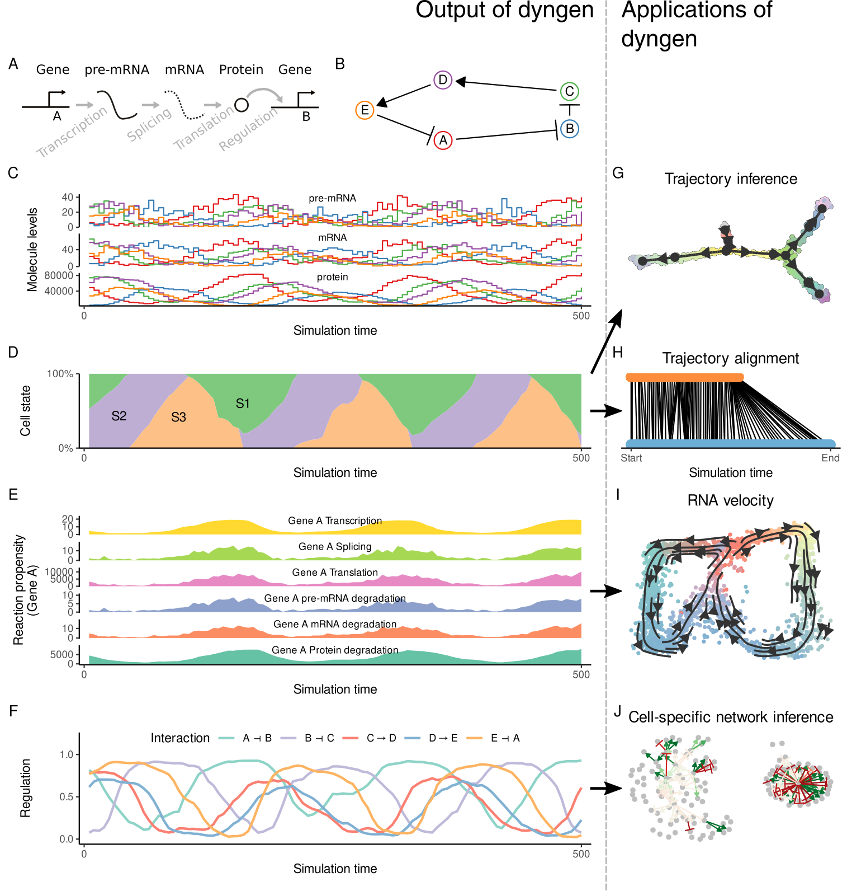

---
output:
  github_document:
    html_preview: false
editor_options: 
  chunk_output_type: console
---
```{r setup, include=FALSE}
knitr::opts_chunk$set(fig.path = "man/figures/README_", warning=FALSE, message=FALSE, error=FALSE, echo = TRUE)

library(tidyverse)
submission_to_cran <- FALSE
```

# dyngen 
[](https://cran.r-project.org/package=dyngen)
[](https://cran.r-project.org/package=dyngen)
[](https://doi.org/10.1101/2020.02.06.936971)
[](https://github.com/dynverse/dyngen/actions?query=workflow%3AR-CMD-check)
[](https://codecov.io/gh/dynverse/dyngen?branch=master)

dyngen is a novel, multi-modal simulation engine for studying dynamic cellular processes at single-cell resolution. dyngen is more flexible than current single-cell simulation engines, and allows better method development and benchmarking, thereby stimulating development and testing of novel computational methods.

A preprint is available on [bioRxiv](https://doi.org/10.1101/2020.02.06.936971). Run `citation("dyngen")` to obtain the corresponding citation information. All source code for reproducing the results in this manuscript are available on [GitHub](https://github.com/dynverse/dyngen_manuscript).

```{r out.width = '60%', echo = FALSE}

```

## Installation
dyngen should work straight out of the CRAN box by running `install.packages("dyngen")`. Having said that, you should definitely configure a few system variables for optimal speed. Check the [installation guide](https://dyngen.dynverse.org/articles/installation.html) for more information!

## Getting started

Check out [this guide](https://dyngen.dynverse.org/articles/getting_started.html) on how to get started with dyngen. You can find more guides by clicking any of the links below:

```{r vignettes, results='asis', echo=FALSE}
walk(
  list.files("vignettes", pattern = "*.Rmd"),
  function(file) {
    title <- 
      read_lines(paste0("vignettes/", file)) %>% 
      keep(~grepl("^title: ", .)) %>% 
      gsub("title: \"(.*)\"", "\\1", .)
    vignette_name <- gsub("\\.Rmd", "", file)
    html_name <- gsub("\\.Rmd", ".html", file)
    
    cat("* [", title, "](https://dyngen.dynverse.org/articles/", html_name, ")\n", sep = "")
  }
)
```

## Latest changes

A full list of changes is available on our [changelog](https://dyngen.dynverse.org/news/index.html).