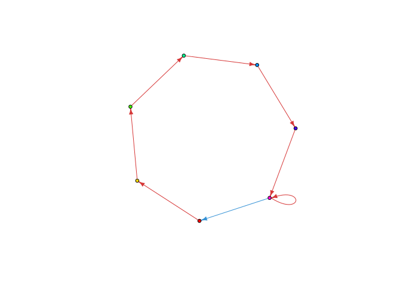
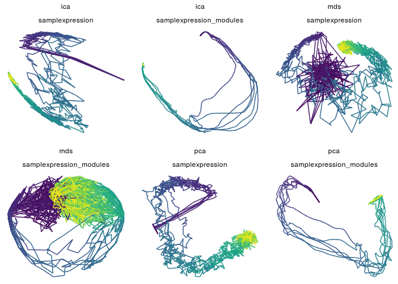
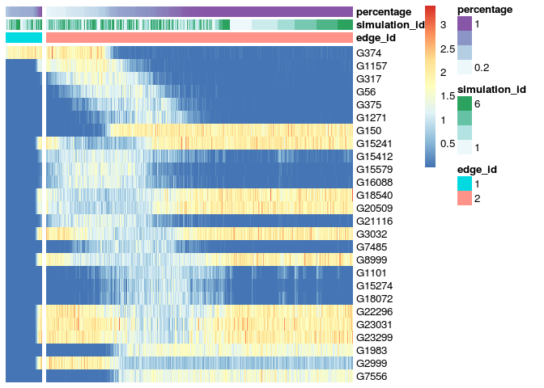
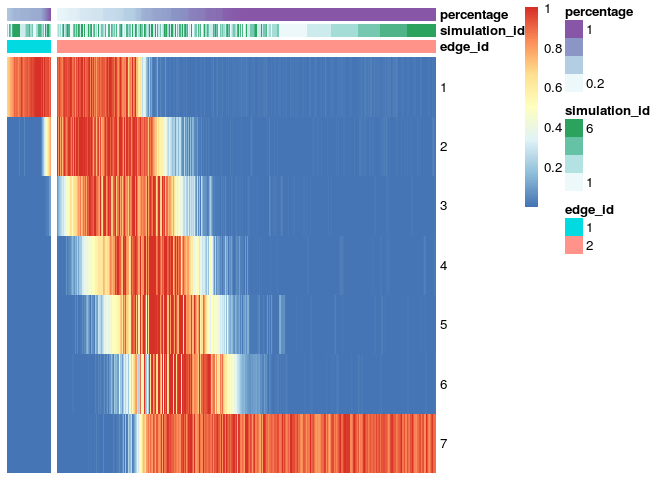

dyngen
================

[](https://travis-ci.org/dynverse/dyngen) [](https://codecov.io/gh/dynverse/dyngen)

A package to generating synthetic single-cell data starting from regulatory networks. The data is generated in several steps: 

``` r
library(tidyverse)
library(dyngen)

params <- simple_params
options(ncores = 1)
```

Generating a regulatory network and a system of differential equations

``` r
model <- invoke(generate_model_from_modulenet, params$model)
```

    ## [1] "Generating main network"
    ## [1] "Sampling targets"
    ## [1] "Randomizing network"
    ## [1] "Generating system"

``` r
plot_net(model)
```



Simulating this system

``` r
simulation <- invoke(simulate_multiple, params$simulation, model$system)
plot_simulation_space_time(simulation)
```



Extracting the gold standard trajectory from the simulations

``` r
gs <- invoke(extract_goldstandard, params$gs, simulation, model)
```

    ## [1] "Preprocessing"
    ## [1] "Extracting milestone paths"
    ## [1] "Processing operations"
    ## [1] "Extracting references"
    ## [1] "Mapping simulations onto reference"
    ## [1] "Postprocessing"

``` r
plot_goldstandard_heatmap(simulation, gs)
```



Simulating the single-cell RNA-seq experiment

``` r
experiment <- invoke(run_experiment, params$experiment, simulation, gs)
```

Normalising the data

``` r
normalisation <- invoke(dynnormaliser::normalise_filter_counts, params$normalisation, experiment$counts)
```

Wrapping in a task

``` r
task <- wrap_task("readme_dataset", params, model, simulation, gs, experiment, normalisation)
```
