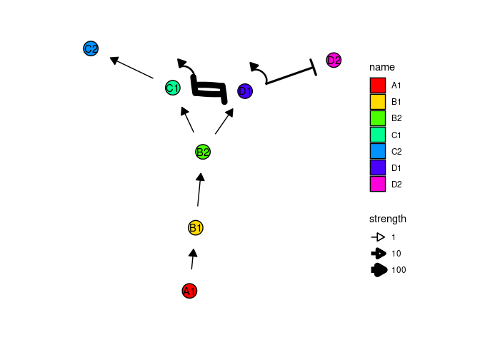
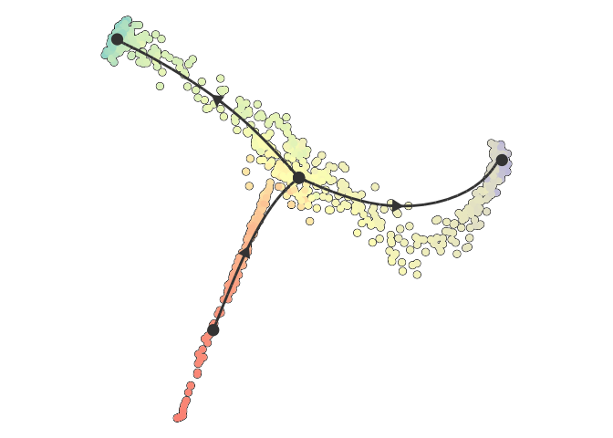
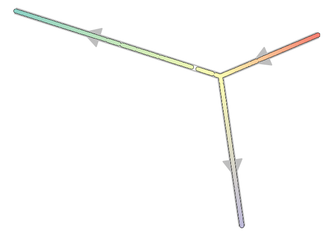

dyngen
================

[](https://travis-ci.org/dynverse/dyngen)
[](https://codecov.io/gh/dynverse/dyngen)

A package to generating synthetic single-cell data starting from
regulatory networks. The data is generated in several steps:


## Example run

### Step 1: Define backbone and other parameters

A dyngen simulation can be started by providing a backbone to the
`initialise_model()` function. The backbone of a `dyngen` model is what
determines the overall dynamic process that a cell will undergo during a
simulation. It consists of a set of gene modules, which regulate
eachother in such a way that expression of certain genes change over
time in a specific manner.

``` r
library(tidyverse)
library(dyngen)

set.seed(1)
model <- 
  initialise_model(
    num_tfs = 12,
    num_targets = 30,
    num_hks = 15,
    backbone = backbone_bifurcating(),
    verbose = TRUE
  )

plot_backbone(model)
```

<!-- -->

### Step 2: Generate transcription factors (TFs)

Each gene module consists of a set of transcription factors. These can
be generated and visualised as follows.

``` r
model <- generate_tf_network(model)
```

    ## Generating TF network

``` r
plot_feature_network(model, show_targets = FALSE)
```

<!-- -->

### Step 3: Sample target genes and housekeeping genes (HKs)

Next, target genes and housekeeping genes are added to the network by
sampling a gold standard gene regulatory network using the Page Rank
algorithm. Target genes are regulated by TFs or other target genes,
while HKs are only regulated by themselves.

``` r
model <- generate_feature_network(model)
```

    ## Sampling feature network from real network

``` r
plot_feature_network(model)
```

<!-- -->

``` r
plot_feature_network(model, show_hks = TRUE)
```

<!-- -->

### Step 4: Generate kinetics

Note that the target network does not show the effect of some
interactions, because these are generated along with other kinetics
parameters of the SSA simulation.

``` r
model <- generate_kinetics(model)
```

    ## Generating kinetics for 57 features
    ## Generating formulae

``` r
plot_feature_network(model)
```

<!-- -->

``` r
plot_feature_network(model, show_hks = TRUE)
```

<!-- -->

### Step 5: Simulate gold standard

The gold standard is simulated by enabling certain parts of the module
network and performing ODE simulations. The gold standard are visualised
by performing a dimensionality reduction on the mRNA expression values.

``` r
model <- generate_gold_standard(model)
```

    ## Generating gold standard mod changes
    ## Precompiling propensity functions for gold standard
    ## Running gold simulations
    ## 
      |                                                  | 0 % elapsed =00s  
      |=============                                     | 25% elapsed =00s, remaining ~00s
      |=========================                         | 50% elapsed =00s, remaining ~00s
      |======================================            | 75% elapsed =00s, remaining ~00s
      |==================================================| 100% elapsed =00s, remaining ~00s

``` r
plot_gold_simulations(model) + scale_colour_brewer(palette = "Dark2")
```

<!-- -->

The expression of the modules (average of TFs) can be visualised as
follows.

``` r
plot_gold_expression(model, what = "x") # mrna
```

<!-- -->

``` r
plot_gold_expression(model) # premrna, mrna, and protein
```

<!-- -->

### Step 6: Simulate cells.

Cells are simulated by running SSA simulations. The simulations are
again using dimensionality reduction.

``` r
model <- generate_cells(model)
```

    ## Precompiling propensity functions for simulations
    ## Running 32 simulations
    ## Mapping simulations to gold standard
    ## Performing dimred

``` r
plot_simulations(model)
```

<!-- -->

The gold standard can be overlayed on top of the simulations.

``` r
plot_gold_simulations(model) + scale_colour_brewer(palette = "Dark2")
```

<!-- -->

We can check how each segment of a simulation is mapped to the gold
standard.

``` r
plot_gold_mappings(model, do_facet = FALSE) + scale_colour_brewer(palette = "Dark2")
```

<!-- -->

The expression of the modules (average of TFs) of a single simulation
can be visualised as follows.

``` r
plot_simulation_expression(model, 1, what = "x")
```

<!-- -->

### Step 7: Experiment emulation

Effects from performing a single-cell RNA-seq experiment can be emulated
as follows.

``` r
model <- generate_experiment(model)
```

    ## Simulating experiment

### Step 8: Convert to a dynwrap object

``` r
traj <- wrap_dataset(model)
```

### Visualise with `dynplot`

``` r
library(dynplot)
plot_dimred(traj)
```

<!-- -->

``` r
plot_graph(traj)
```

<!-- -->

### Infer trajectory on expression data

``` r
# library(dyno)
# out <- infer_trajectory(traj, ti_slingshot())
# plot_dimred(out)
```
