dyngen
================

[](https://travis-ci.org/dynverse/dyngen)
[](https://codecov.io/gh/dynverse/dyngen)

A package for generating synthetic single-cell data starting from
regulatory networks. The data is generated in several steps:


## Step-by-step example run

### Step 1: Define backbone and other parameters

A dyngen simulation can be started by providing a backbone to the
`initialise_model()` function. The backbone of a `dyngen` model is what
determines the overall dynamic process that a cell will undergo during a
simulation. It consists of a set of gene modules, which regulate
eachother in such a way that expression of certain genes change over
time in a specific manner.

``` r
library(tidyverse)
library(dyngen)

set.seed(1)
model <- 
  initialise_model(
    num_tfs = 12,
    num_targets = 30,
    num_hks = 15,
    backbone = backbone_bifurcating(),
    verbose = TRUE
  )

plot_backbone_statenet(model)
```

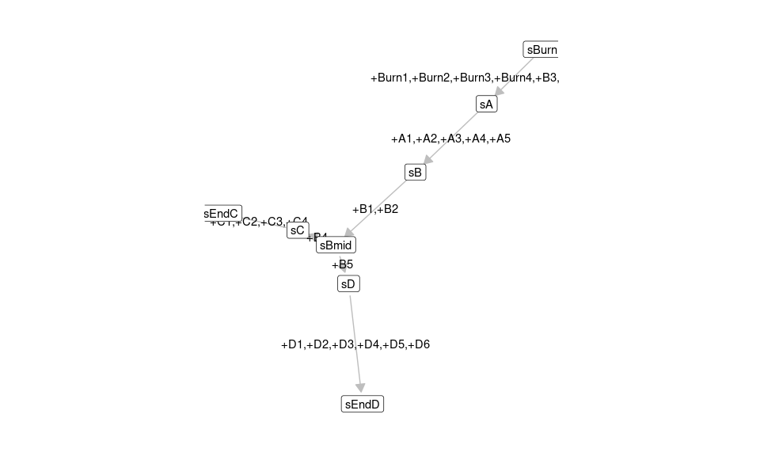<!-- -->

``` r
plot_backbone_modulenet(model)
```

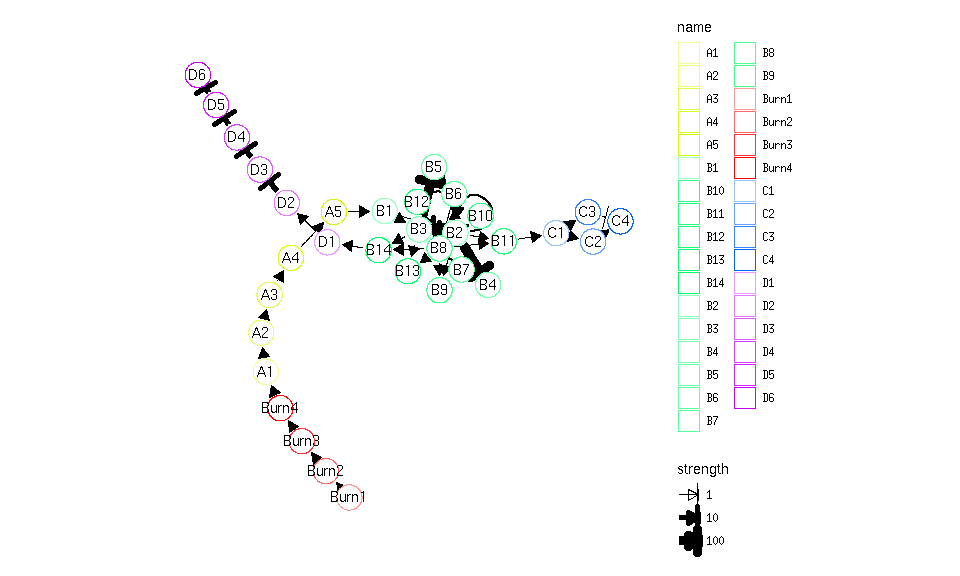<!-- -->

For backbones with all different sorts of topologies, check
`list_backbones()`:

``` r
names(list_backbones())
```

    ##  [1] "bifurcating"             "bifurcating_converging" 
    ##  [3] "bifurcating_cycle"       "bifurcating_loop"       
    ##  [5] "binary_tree"             "branching"              
    ##  [7] "consecutive_bifurcating" "converging"             
    ##  [9] "cycle"                   "disconnected"           
    ## [11] "linear"                  "trifurcating"

### Step 2: Generate transcription factors (TFs)

Each gene module consists of a set of transcription factors. These can
be generated and visualised as follows.

``` r
model <- generate_tf_network(model)
```

    ## Generating TF network

``` r
plot_feature_network(model, show_targets = FALSE)
```

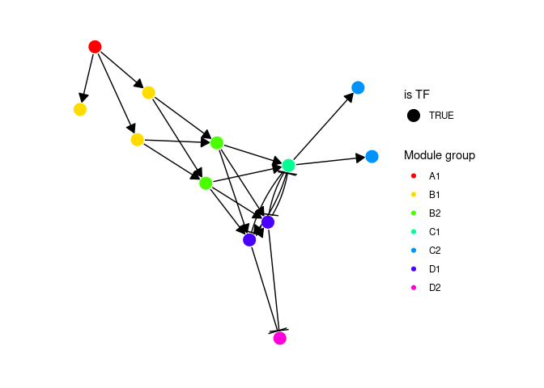<!-- -->

### Step 3: Sample target genes and housekeeping genes (HKs)

Next, target genes and housekeeping genes are added to the network by
sampling a gold standard gene regulatory network using the Page Rank
algorithm. Target genes are regulated by TFs or other target genes,
while HKs are only regulated by themselves.

``` r
model <- generate_feature_network(model)
```

    ## Sampling feature network from real network

``` r
plot_feature_network(model)
```

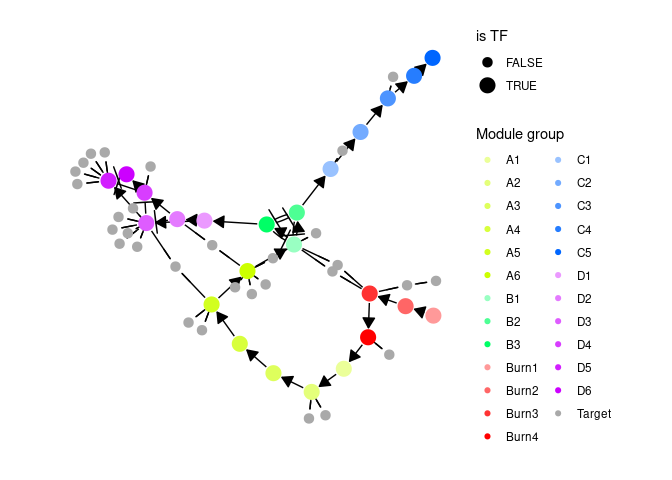<!-- -->

``` r
plot_feature_network(model, show_hks = TRUE)
```

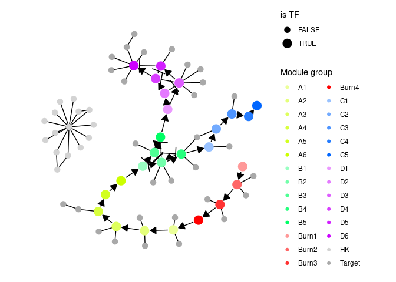<!-- -->

### Step 4: Generate kinetics

Note that the target network does not show the effect of some
interactions, because these are generated along with other kinetics
parameters of the SSA simulation.

``` r
model <- generate_kinetics(model)
```

    ## Generating kinetics for 71 features
    ## Generating formulae

``` r
plot_feature_network(model)
```

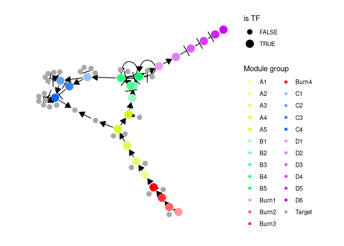<!-- -->

``` r
plot_feature_network(model, show_hks = TRUE)
```

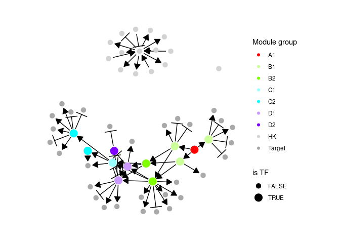<!-- -->

### Step 5: Simulate gold standard

The gold standard is simulated by enabling certain parts of the module
network and performing ODE simulations. The gold standard are visualised
by performing a dimensionality reduction on the mRNA expression values.

``` r
model <- generate_gold_standard(model)
```

    ## Generating gold standard mod changes
    ## Precompiling reactions for gold standard
    ## Running gold simulations
    ## 
      |                                                  | 0 % elapsed =00s  
      |=========                                         | 17% elapsed =00s, remaining ~00s
      |=================                                 | 33% elapsed =00s, remaining ~00s
      |=========================                         | 50% elapsed =00s, remaining ~00s
      |==================================                | 67% elapsed =00s, remaining ~00s
      |==========================================        | 83% elapsed =00s, remaining ~00s
      |==================================================| 100% elapsed =00s, remaining ~00s

``` r
plot_gold_simulations(model) + scale_colour_brewer(palette = "Dark2")
```

<!-- -->

The expression of the modules (average of TFs) can be visualised as
follows.

``` r
plot_gold_expression(model, what = "x") # mrna
```

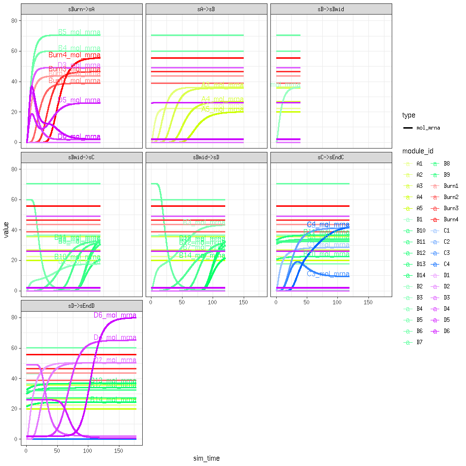<!-- -->

``` r
plot_gold_expression(model, label_changing = FALSE) # premrna, mrna, and protein
```

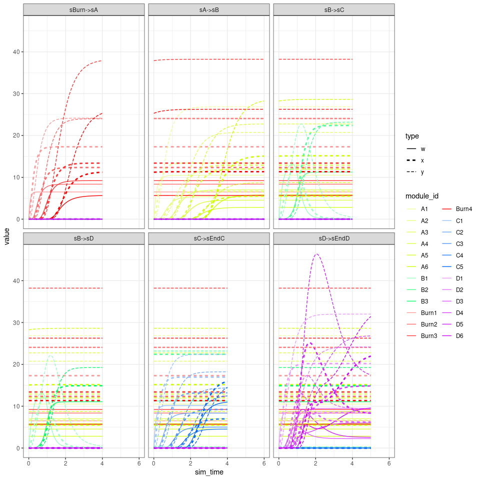<!-- -->

### Step 6: Simulate cells.

Cells are simulated by running SSA simulations. The simulations are
again using dimensionality reduction.

``` r
model <- generate_cells(model)
```

    ## Precompiling reactions for simulations
    ## Running 32 simulations
    ## Mapping simulations to gold standard
    ## Performing dimred

``` r
plot_simulations(model)
```

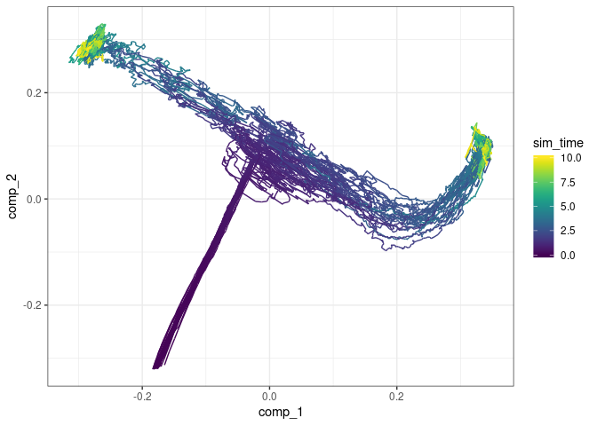<!-- -->

The gold standard can be overlayed on top of the simulations.

``` r
plot_gold_simulations(model) + scale_colour_brewer(palette = "Dark2")
```

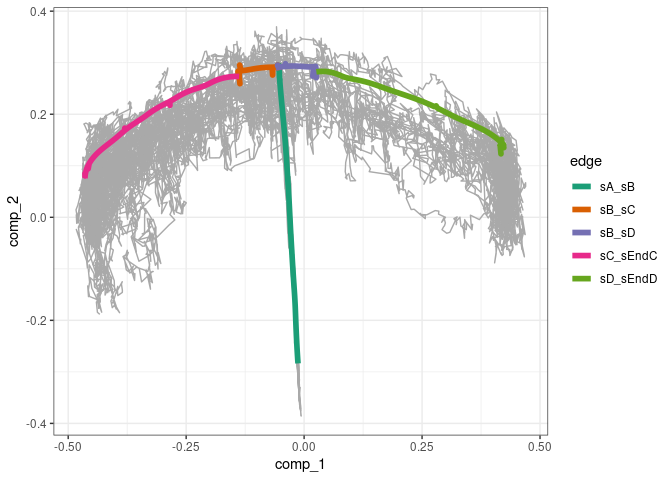<!-- -->

We can check how each segment of a simulation is mapped to the gold
standard.

``` r
plot_gold_mappings(model, do_facet = FALSE) + scale_colour_brewer(palette = "Dark2")
```

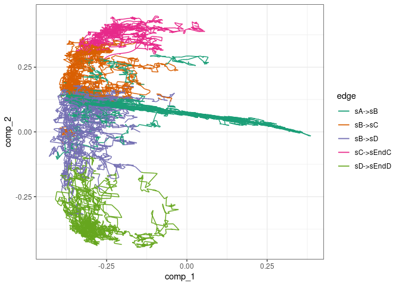<!-- -->

The expression of the modules (average of TFs) of a single simulation
can be visualised as follows.

``` r
plot_simulation_expression(model, 1:4, what = "x")
```

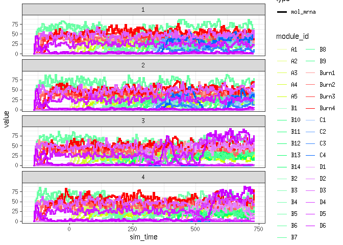<!-- -->

### Step 7: Experiment emulation

Effects from performing a single-cell RNA-seq experiment can be emulated
as follows.

``` r
model <- generate_experiment(model)
```

    ## Simulating experiment

### Step 8: Convert to a dynwrap object

``` r
dataset <- wrap_dataset(model)
```

### Visualise with `dynplot`

``` r
library(dynplot)
plot_dimred(dataset)
```

<!-- -->

``` r
plot_graph(dataset)
```

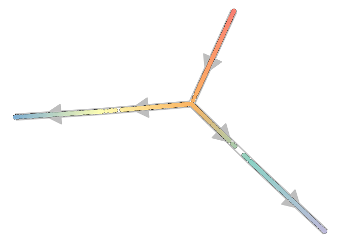<!-- -->

### Infer trajectory on expression data

``` r
library(dyno)
pred <- infer_trajectory(dataset, ti_slingshot())
plot_dimred(pred)
```

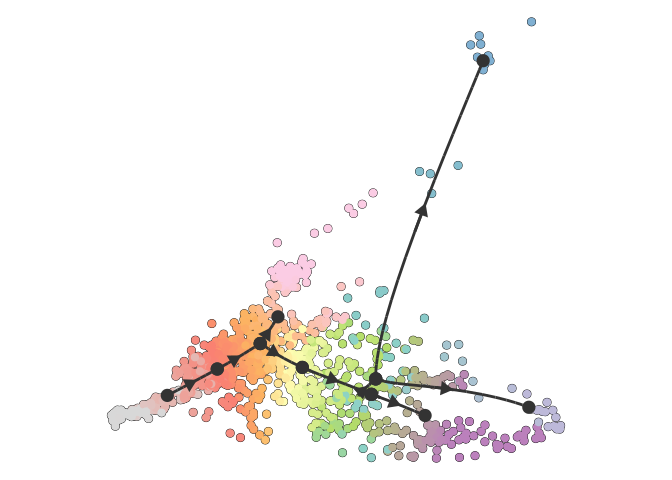<!-- -->

## One-shot function

`dyngen` also provides a one-shot function for running all of the steps
all at once and producing plots.

``` r
set.seed(1)
init <- 
  initialise_model(
    num_tfs = 12,
    num_targets = 30,
    num_hks = 15,
    backbone = backbone_bifurcating_converging(),
    verbose = FALSE
  )
out <- generate_dataset(
  init,
  make_plots = TRUE
)
```

    ## 
      |                                                  | 0 % elapsed =00s  
      |========                                          | 14% elapsed =00s, remaining ~00s
      |===============                                   | 29% elapsed =00s, remaining ~00s
      |======================                            | 43% elapsed =00s, remaining ~00s
      |=============================                     | 57% elapsed =00s, remaining ~00s
      |====================================              | 71% elapsed =00s, remaining ~00s
      |===========================================       | 86% elapsed =00s, remaining ~00s
      |==================================================| 100% elapsed =00s, remaining ~00s

``` r
dataset <- out$dataset
model <- out$model
print(out$plot)
```

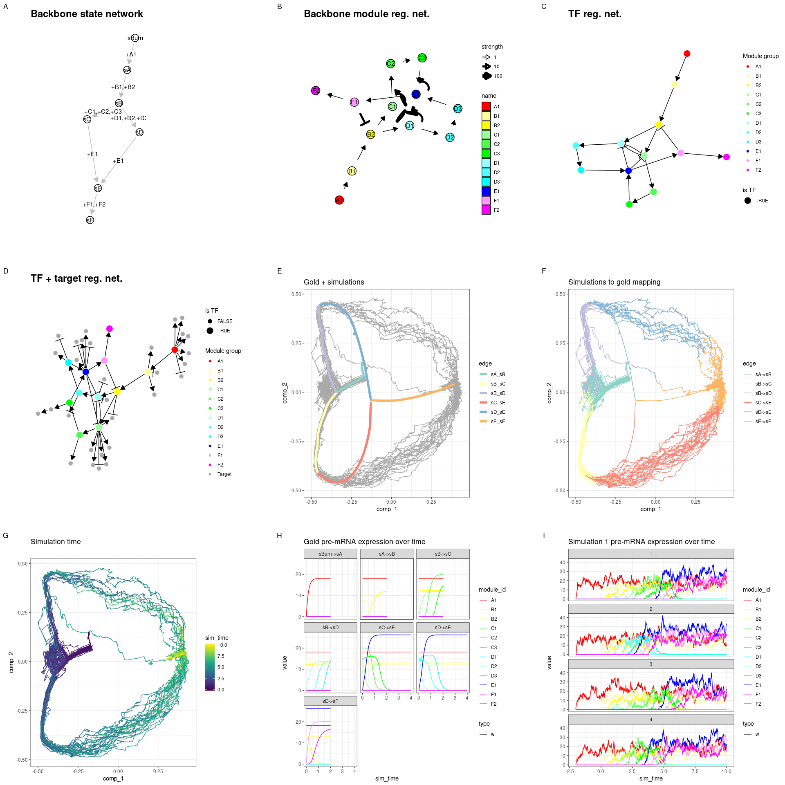<!-- -->

`dataset` and `model` can be used in much the same way as before.

``` r
plot_dimred(dataset)
```

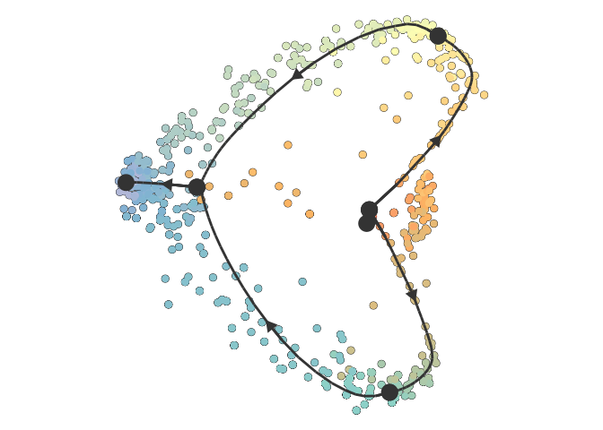<!-- -->

``` r
plot_graph(dataset)
```

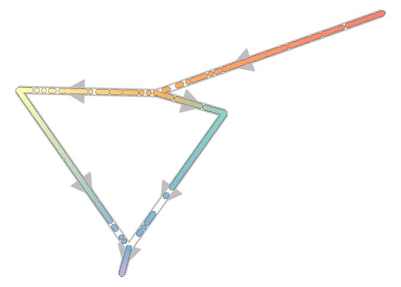<!-- -->

``` r
pred <- infer_trajectory(dataset, ti_slingshot(), verbose = FALSE)
plot_dimred(pred)
```

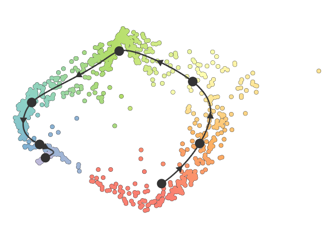<!-- -->

## Experimental feature: construct your own backbone

In addition to the backbones already defined by `dyngen`, you can define
your own custom backbone by using one of two ways.

### Manually

The first approach is to study the `?backbone` documentation. This will
allow you to create any sort of backbone you like (disconnected, cyclic,
converging, …), but also requires you to understand the backbone in
detail and will typically involve experimenting with the different
parameters a little bit.

This is an example of what data structures a backbone consists of.

``` r
backbone <- backbone_bifurcating_loop()

print(backbone$module_info)
```

    ## # A tibble: 13 x 4
    ##    module_id    a0 burn  color  
    ##    <chr>     <dbl> <lgl> <chr>  
    ##  1 A1            1 TRUE  #FF9999
    ##  2 A2            0 TRUE  #FF4D4D
    ##  3 A3            1 TRUE  #FF0000
    ##  4 B1            0 FALSE #CCFF99
    ##  5 B2            1 TRUE  #80FF00
    ##  6 C1            0 FALSE #99FFFF
    ##  7 C2            0 FALSE #4DFFFF
    ##  8 C3            0 FALSE #00FFFF
    ##  9 D1            0 FALSE #CC99FF
    ## 10 D2            0 FALSE #B973FF
    ## 11 D3            1 TRUE  #A64DFF
    ## 12 D4            0 FALSE #9326FF
    ## 13 D5            0 FALSE #8000FF

``` r
print(backbone$module_network)
```

    ## # A tibble: 22 x 5
    ##    from  to    effect strength cooperativity
    ##    <chr> <chr>  <dbl>    <dbl>         <dbl>
    ##  1 A1    A2         1       10             2
    ##  2 A2    A3        -1       10             2
    ##  3 A2    B1         1        1             2
    ##  4 B1    B2        -1       10             2
    ##  5 B1    C1         1        1             2
    ##  6 B1    D1         1        1             2
    ##  7 C1    C1         1       10             2
    ##  8 C1    D1        -1      100             2
    ##  9 C1    C2         1        1             2
    ## 10 C2    C3         1        1             2
    ## # … with 12 more rows

``` r
print(backbone$expression_patterns)
```

    ## # A tibble: 5 x 6
    ##   from  to    module_progression              start burn   time
    ##   <chr> <chr> <chr>                           <lgl> <lgl> <dbl>
    ## 1 sBurn sA    +A1,+A2,+A3,+B2,+D3             TRUE  TRUE      2
    ## 2 sA    sB    +B1                             FALSE FALSE     2
    ## 3 sB    sC    +C1,+C2|-A2,-B1,+C3|-C1,-D1,-D2 FALSE FALSE     3
    ## 4 sB    sD    +D1,+D2,+D4,+D5                 FALSE FALSE     4
    ## 5 sC    sA    +A1,+A2                         FALSE FALSE     2

This allows you to simulate the following dataset.

``` r
out <- 
  initialise_model(
    backbone = backbone,
    num_tfs = 40,
    num_targets = 0,
    num_hks = 0,
    verbose = FALSE
  ) %>% 
  generate_dataset(make_plots = TRUE)
```

    ## 
      |                                                  | 0 % elapsed =00s  
      |========                                          | 14% elapsed =00s, remaining ~00s
      |===============                                   | 29% elapsed =00s, remaining ~00s
      |======================                            | 43% elapsed =00s, remaining ~00s
      |=============================                     | 57% elapsed =00s, remaining ~00s
      |====================================              | 71% elapsed =00s, remaining ~00s
      |===========================================       | 86% elapsed =00s, remaining ~00s
      |==================================================| 100% elapsed =00s, remaining ~00s

``` r
print(out$plot)
```

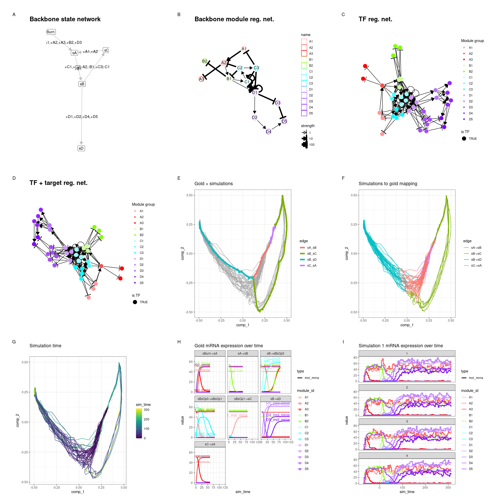<!-- -->

### Backbone lego

Alternatively, you can use the `bblego` functions in order to create
custom backbones using various components. Please note that the `bblego`
functions currently only allow you to create tree-like backbones. See
`?bblego` for more details.

Here is an example of a bifurcating trajectory.

``` r
backbone <- bblego(
  bblego_start("A", type = "simple", num_modules = 2),
  bblego_linear("A", "B", type = "flipflop", num_modules = 4),
  bblego_branching("B", c("C", "D"), type = "simple", num_modules = 6),
  bblego_end("C", type = "doublerep2", num_modules = 4),
  bblego_end("D", type = "doublerep1", num_modules = 7)
)

out <- 
  initialise_model(
    backbone = backbone,
    num_tfs = 40,
    num_targets = 0,
    num_hks = 0,
    verbose = FALSE
  ) %>% 
  generate_dataset(make_plots = TRUE)
```

    ## 
      |                                                  | 0 % elapsed =00s  
      |=========                                         | 17% elapsed =00s, remaining ~00s
      |=================                                 | 33% elapsed =00s, remaining ~00s
      |=========================                         | 50% elapsed =00s, remaining ~00s
      |==================================                | 67% elapsed =00s, remaining ~00s
      |==========================================        | 83% elapsed =00s, remaining ~00s
      |==================================================| 100% elapsed =00s, remaining ~00s

``` r
print(out$plot)
```

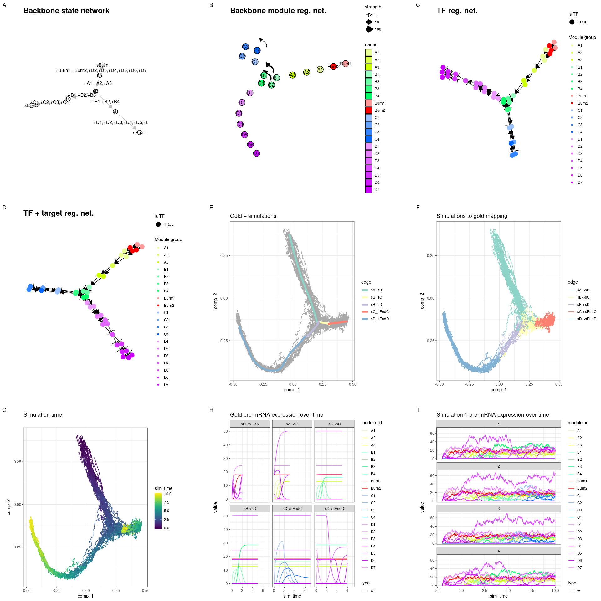<!-- -->

## Latest changes

Check out `news(package = "dyngen")` or [NEWS.md](NEWS.md) for a full
list of changes.

<!-- This section gets automatically generated from NEWS.md -->

### Recent changes in dyngen 0.2.2 (unreleased)

  - MINOR CHANGES: Fix module naming of backbones derived from
    `backbone_branching()`.

  - MINOR CHANGES: Allow to plot labels in
    `plot_simulation_expression()`.

  - FIX: Implement fix for double positives in `bblego` backbones.

  - FIX: Fix graph plotting mixup of interaction effects (up/down).

  - MINOR CHANGES: Improve `backbone_disconnected()` and
    `backbone_converging()`.

### Recent changes in dyngen 0.2.1 (2019-07-17)

  - MAJOR CHANGES: Custom backbones can be defined using backbone lego
    pieces. See `?bblego` for more information.

  - MAJOR CHANGES: Splicing reactions have been reworked to better
    reflect biology.
