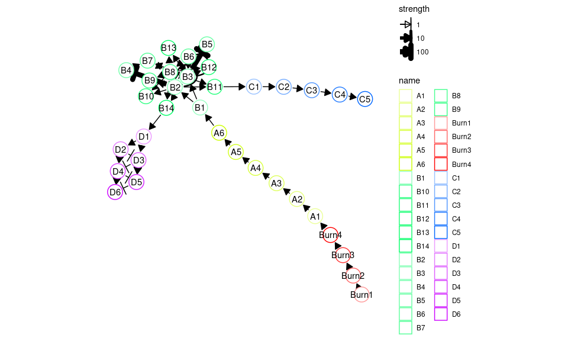
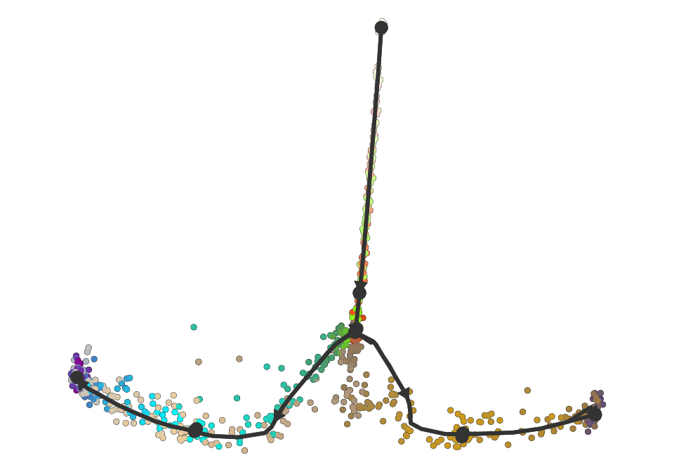
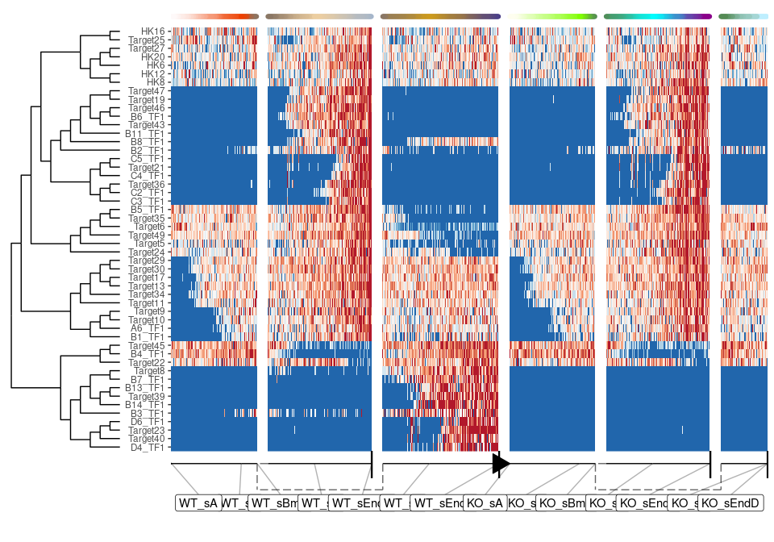

Advanced: Simulating a knockout experiment
================

<!-- github markdown built using 
rmarkdown::render("vignettes/advanced_simulating_knockouts.Rmd", output_format = rmarkdown::github_document())
-->

dyngen supports simulating knockout (or knockdown) experiments.

## Single-gene KO vs. WT

In this experiment, dyngen is run twice (similar to the vignette on
simulating batch effects), once for the wild type (WT), and once for the
knockout (KO).

### The common part of dyngen

First, create the ‘common’ part of the dyngen simulation as follows.
This will ensure that the gene regulatory network-part of the simulation
is exactly the same.

``` r
library(tidyverse)
library(dyngen)

set.seed(1)

backbone <- backbone_bifurcating()

model_common <-
  initialise_model(
  backbone = backbone,
  num_cells = 1000,
  num_tfs = nrow(backbone$module_info),
  num_targets = 250,
  num_hks = 250,
  simulation_params = simulation_default(
    census_interval = 10, 
    ssa_algorithm = ssa_etl(tau = 300 / 3600),
    experiment_params = simulation_type_wild_type(num_simulations = 100)
  )
) %>%
  generate_tf_network() %>%
  generate_feature_network() %>% 
  generate_kinetics() %>%
  generate_gold_standard()
```

    ## Generating TF network
    ## Sampling feature network from real network
    ## Generating kinetics for 535 features
    ## Generating formulae
    ## Generating gold standard mod changes
    ## Precompiling reactions for gold standard
    ## Running gold simulations
    ##   |                                                  | 0 % elapsed=00s     |========                                          | 14% elapsed=00s, remaining~01s  |===============                                   | 29% elapsed=00s, remaining~01s  |======================                            | 43% elapsed=00s, remaining~00s  |=============================                     | 57% elapsed=00s, remaining~00s  |====================================              | 71% elapsed=00s, remaining~00s  |===========================================       | 86% elapsed=01s, remaining~00s  |==================================================| 100% elapsed=01s, remaining~00s

``` r
plot_backbone_modulenet(model_common)
```

<!-- -->

``` r
plot_feature_network(model_common)
```

<!-- -->

### Simulate wild type

Simulating the wild type is easy, as it is the standard dyngen way of
simulating cells.

``` r
model_wt <- model_common %>%
  generate_cells()
```

    ## Precompiling reactions for simulations
    ## Running 100 simulations
    ## Mapping simulations to gold standard
    ## Performing dimred

### Simulate knockout

``` r
model_ko <- model_common
model_ko$simulation_params$experiment_params <- simulation_type_knockdown(
  num_simulations = 100L,
  timepoint = 0, 
  genes = "B3_TF1", 
  num_genes = 1, 
  multiplier = 0
)

model_ko <- model_ko %>%
  generate_cells()
```

    ## Precompiling reactions for simulations
    ## Running 100 simulations
    ## Mapping simulations to gold standard

    ## Warning in .generate_cells_predict_state(model): Simulation does not contain all gold standard edges. This simulation likely suffers from bad kinetics; choose a different seed and rerun.

    ## Performing dimred

### Combine outputs and visualise

Finally, combine the simulations as follows.

``` r
model_comb <-
  combine_models(list(WT = model_wt, KO = model_ko)) %>% 
  generate_experiment()
```

    ## Merging model 1/2 WT
    ## Merging model 2/2 KO
    ## Recomputing dimred
    ## Simulating experiment

Show a dimensionality reduction.

``` r
plot_simulations(model_comb)
```

<!-- -->

``` r
plot_gold_mappings(model_comb, do_facet = FALSE)
```

<!-- -->

Visualise the dataset using dyno.

``` r
library(dyno)
dataset <- as_dyno(model_comb)
plot_dimred(dataset)
```

    ## Coloring by milestone

    ## Using milestone_percentages from trajectory

<!-- -->

``` r
plot_heatmap(dataset, features_oi = 50)
```

    ## No features of interest provided, selecting the top 50 features automatically

    ## Using dynfeature for selecting the top 50 features

    ## root cell or milestone not provided, trying first outgoing milestone_id

    ## Using 'WT_sA' as root

    ## Coloring by milestone

<!-- -->
