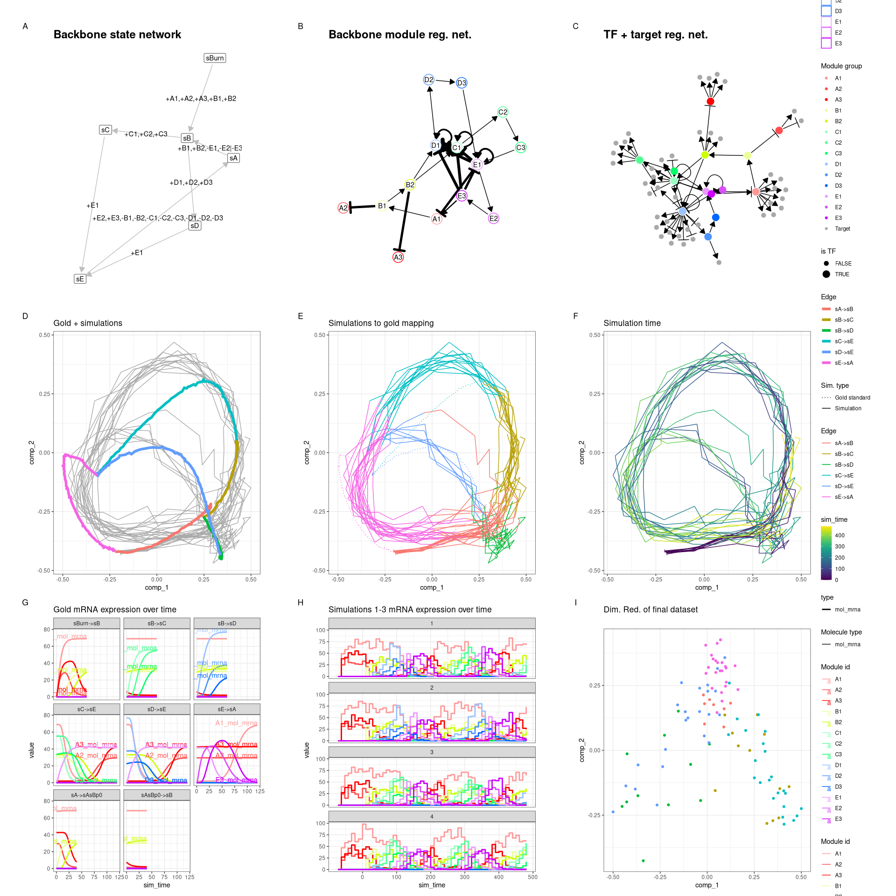
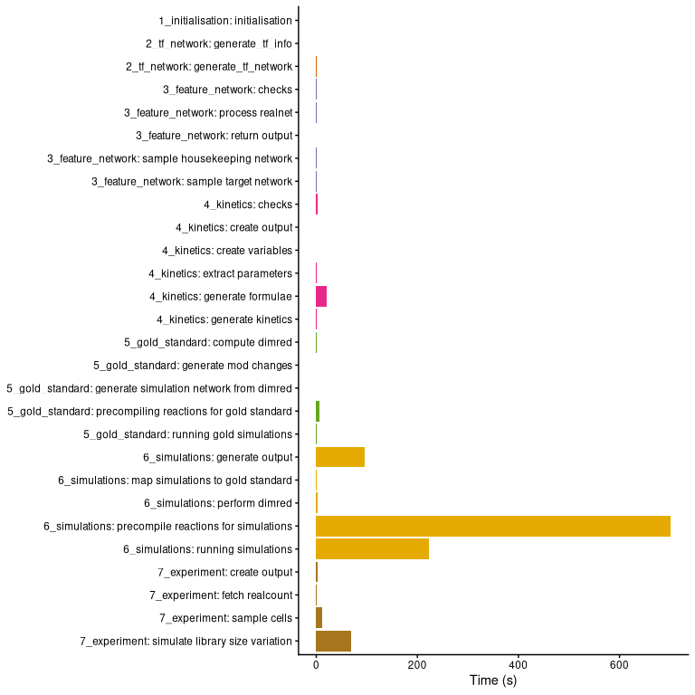
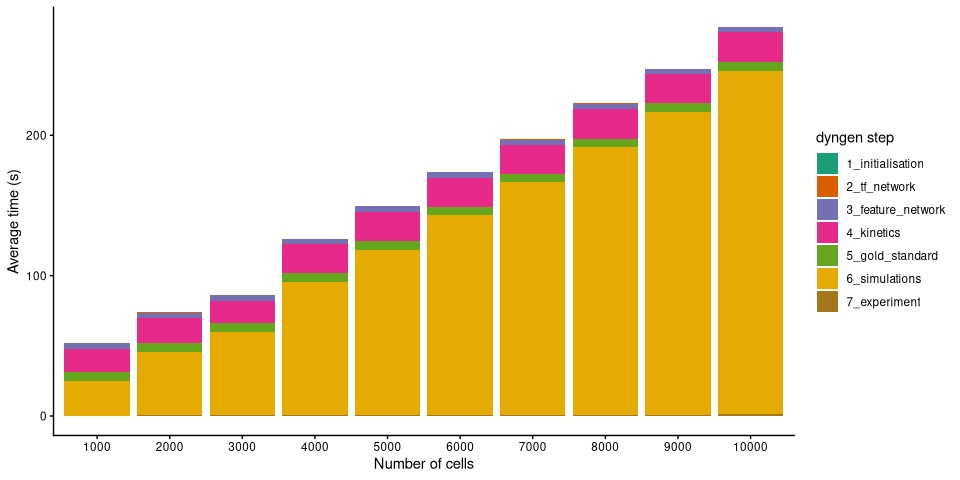
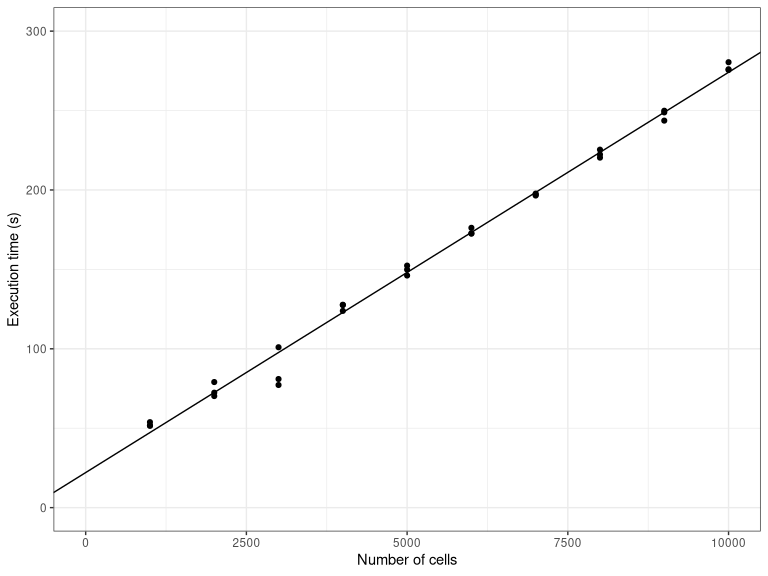
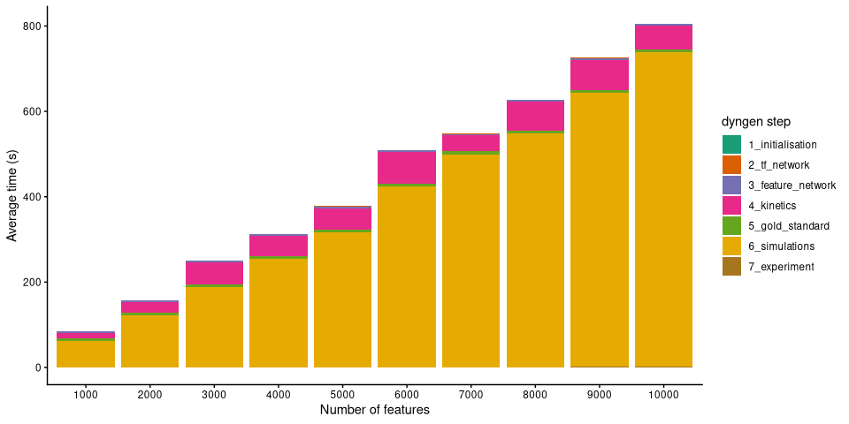
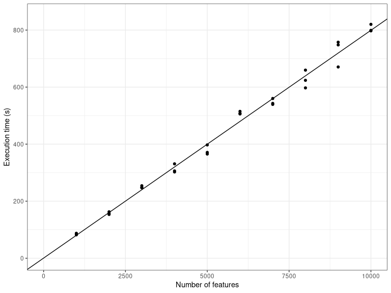

Advanced: On scalability and runtime
================

``` r
library(tidyverse)
library(dyngen)
```

<!-- github markdown built using 
rmarkdown::render("vignettes/scalability_and_runtime.Rmd", output_format = rmarkdown::github_document())
-->

In this vignette, we will take a look at the runtime of dyngen as the
number of genes and the number of cells sampled is increased. We’ll be
using the bifurcating cycle backbone which is well known for its
beautiful 3D butterfly shape!

``` r
library(dyngen)
library(tidyverse)

set.seed(1)

save_dir <- "scalability_and_runtime_runs"
if (!dir.exists(save_dir)) dir.create(save_dir, recursive = TRUE)

backbone <- backbone_bifurcating_cycle()
```

## Initial run

We’ll be running this simulation a few times, with different values for
`num_cells` and `num_features` to assess the scalability of dyngen. An
example of a resulting dyngen model is shown here.

``` r
num_cells <- 100
num_features <- 100
num_tfs <- nrow(backbone$module_info)
num_targets <- round((num_features - num_tfs) / 2)
num_hks <- num_features - num_targets - num_tfs

out <-
  initialise_model(
    backbone = backbone,
    num_tfs = num_tfs,
    num_targets = num_targets,
    num_hks = num_hks,
    num_cells = num_cells,
    gold_standard_params = gold_standard_default(
      census_interval = 1,
      tau = 100 / 3600
    ),
    simulation_params = simulation_default(
      census_interval = 10,
      ssa_algorithm = ssa_etl(tau = 300 / 3600),
      experiment_params = simulation_type_wild_type(
        num_simulations = num_cells / 10
      )
    ),
    verbose = FALSE
  ) %>%
  generate_dataset(make_plots = TRUE)
```

``` r
out$plot
```

<!-- -->

We tweaked some of the parameters by running this particular backbone
once with `num_cells = 100` and `num_features = 100` and verifying that
the new parameters still yield the desired outcome. The parameters we
tweaked are:

- On average, 10 cells are sampled per simulation
  (e.g. `num_simulations = 100` and `num_cells = 1000`). You could
  increase this ratio to get a better cell count yield from a given set
  of simulations, but cells from the same simulation that are temporally
  close will have highly correlated expression profiles.
- Increased time steps `tau`. This will make the Gillespie algorithm
  slightly faster but might result in unexpected artifacts in the
  simulated data.
- `census_interval` increased from 4 to 10. This will cause dyngen to
  store an expression profile only every 10 time units. Since the total
  simulation time is xxx, each simulation will result in yyy data
  points. Note that on average only 10 data points are sampled per
  simulation.

For more information on parameter tuning, see the vignette ‘Advanced:
tuning the simulation parameters’.

## Timing experiments

The simulations are run once with a large `num_features` and
`num_cells`, a few times with varying `num_cells` and then once more
with varying `num_features`. Every run is repeated three times in order
to get a bit more stable time measurements. Since some of the
simulations can take over 10 minutes, the timings results of the
simulations are cached in the ‘scalability_and_runtime_runs’ folder.\`

``` r
settings <- bind_rows(
  tibble(num_cells = 10000, num_features = 10000, rep = 1), # , rep = seq_len(3)),
  crossing(
    num_cells = seq(1000, 10000, by = 1000),
    num_features = 100,
    rep = seq_len(3)
  ),
  crossing(
    num_cells = 100,
    num_features = seq(1000, 10000, by = 1000),
    rep = seq_len(3)
  )
) %>%
  mutate(filename = paste0(save_dir, "/cells", num_cells, "_feats", num_features, "_rep", rep, ".rds"))

timings <- pmap_dfr(settings, function(num_cells, num_features, rep, filename) {
  if (!file.exists(filename)) {
    set.seed(rep)

    cat("Running num_cells: ", num_cells, ", num_features: ", num_features, ", rep: ", rep, "\n", sep = "")
    num_tfs <- nrow(backbone$module_info)
    num_targets <- round((num_features - num_tfs) / 2)
    num_hks <- num_features - num_targets - num_tfs

    out <-
      initialise_model(
        backbone = backbone,
        num_tfs = num_tfs,
        num_targets = num_targets,
        num_hks = num_hks,
        num_cells = num_cells,
        gold_standard_params = gold_standard_default(
          census_interval = 1,
          tau = 100 / 3600
        ),
        simulation_params = simulation_default(
          census_interval = 10,
          ssa_algorithm = ssa_etl(tau = 300 / 3600),
          experiment_params = simulation_type_wild_type(
            num_simulations = num_cells / 10
          )
        ),
        verbose = FALSE
      ) %>%
      generate_dataset()

    tim <-
      get_timings(out$model) %>%
      mutate(rep, num_cells, num_features)

    write_rds(tim, filename, compress = "gz")
  }

  read_rds(filename)
})

timings_gr <-
  timings %>%
  group_by(group, task, num_cells, num_features) %>%
  summarise(time_elapsed = mean(time_elapsed), .groups = "drop")

timings_sum <-
  timings %>%
  group_by(num_cells, num_features, rep) %>%
  summarise(time_elapsed = sum(time_elapsed), .groups = "drop")
```

## Simulate a large dataset (10k × 10k)

Below is shown the timings of each of the steps in simulating a dyngen
dataset containing 10’000 genes and 10’000 features. The total
simulation time required is 1147 seconds, most of which is spent
performing the simulations itself.

``` r
timings0 <-
  timings_gr %>%
  filter(num_cells == 10000, num_features == 10000) %>%
  mutate(name = forcats::fct_rev(forcats::fct_inorder(paste0(group, ": ", task))))

ggplot(timings0) +
  geom_bar(aes(x = name, y = time_elapsed, fill = group), stat = "identity") +
  scale_fill_brewer(palette = "Dark2") +
  theme_classic() +
  theme(legend.position = "none") +
  coord_flip() +
  labs(x = NULL, y = "Time (s)", fill = "dyngen stage")
```

<!-- -->

## Increasing the number of cells

By increasing the number of cells from 1000 to 10’000 whilst keeping the
number of features fixed, we can get an idea of how the simulation time
scales w.r.t. the number of cells.

``` r
timings1 <-
  timings_gr %>%
  filter(num_features == 100) %>%
  group_by(num_cells, num_features, group) %>%
  summarise(time_elapsed = sum(time_elapsed), .groups = "drop")

ggplot(timings1) +
  geom_bar(aes(x = forcats::fct_inorder(as.character(num_cells)), y = time_elapsed, fill = forcats::fct_inorder(group)), stat = "identity") +
  theme_classic() +
  scale_fill_brewer(palette = "Dark2") +
  labs(x = "Number of cells", y = "Average time (s)", fill = "dyngen step")
```

<!-- -->

It seems the execution time scales linearly w.r.t. the number of cells.
This makes sense, because as the number of cells are increased, so do we
increase the number of simulations made (which is not necessarily
mandatory). Since the simulations are independent of each other and take
up the most time, the execution time will scale linearly.

``` r
ggplot(timings_sum %>% filter(num_features == 100)) +
  theme_bw() +
  geom_point(aes(num_cells, time_elapsed)) +
  scale_x_continuous(limits = c(0, 10000)) +
  scale_y_continuous(limits = c(0, 300)) +
  geom_abline(intercept = 22.097, slope = 0.0252) +
  labs(x = "Number of cells", y = "Execution time (s)")
```

<!-- -->

## Increasing the number of features

By increasing the number of features from 1000 to 10’000 whilst keeping
the number of cells fixed, we can get an idea of how the simulation time
scales w.r.t. the number of features

``` r
timings2 <-
  timings_gr %>%
  filter(num_cells == 100) %>%
  group_by(num_cells, num_features, group) %>%
  summarise(time_elapsed = sum(time_elapsed), .groups = "drop")

ggplot(timings2) +
  geom_bar(aes(x = forcats::fct_inorder(as.character(num_features)), y = time_elapsed, fill = forcats::fct_inorder(group)), stat = "identity") +
  theme_classic() +
  scale_fill_brewer(palette = "Dark2") +
  labs(x = "Number of features", y = "Average time (s)", fill = "dyngen step")
```

<!-- -->

It seems the execution time also scales linearly w.r.t. the number of
features. As more genes are added to the underlying gene regulatory
network, the density of the graph doesn’t change, so it makes sense that
the execution time also scales linearly w.r.t. the number of features.

``` r
ggplot(timings_sum %>% filter(num_cells == 100)) +
  theme_bw() +
  geom_point(aes(num_features, time_elapsed)) +
  scale_x_continuous(limits = c(0, 10000)) +
  scale_y_continuous(limits = c(0, 850)) +
  geom_abline(intercept = 0.5481, slope = 0.07988) +
  labs(x = "Number of features", y = "Execution time (s)")
```

<!-- -->

## Execution platform

These timings were measured using 30 (out of 32) threads using a AMD
Ryzen 9 5950X clocked at 3.4GHz.

Session info:

``` r
sessionInfo()
```

    ## R version 4.5.2 (2025-10-31)
    ## Platform: x86_64-redhat-linux-gnu
    ## Running under: Fedora Linux 42 (Workstation Edition)
    ## 
    ## Matrix products: default
    ## BLAS/LAPACK: FlexiBLAS OPENBLAS-OPENMP;  LAPACK version 3.12.0
    ## 
    ## locale:
    ##  [1] LC_CTYPE=en_GB.UTF-8       LC_NUMERIC=C              
    ##  [3] LC_TIME=en_GB.UTF-8        LC_COLLATE=en_GB.UTF-8    
    ##  [5] LC_MONETARY=en_GB.UTF-8    LC_MESSAGES=en_GB.UTF-8   
    ##  [7] LC_PAPER=en_GB.UTF-8       LC_NAME=C                 
    ##  [9] LC_ADDRESS=C               LC_TELEPHONE=C            
    ## [11] LC_MEASUREMENT=en_GB.UTF-8 LC_IDENTIFICATION=C       
    ## 
    ## time zone: Europe/Brussels
    ## tzcode source: system (glibc)
    ## 
    ## attached base packages:
    ## [1] stats     graphics  grDevices utils     datasets  methods   base     
    ## 
    ## other attached packages:
    ##  [1] countsimQC_1.28.1 dyngen_1.0.6      lubridate_1.9.5   forcats_1.0.1    
    ##  [5] stringr_1.6.0     dplyr_1.2.0       purrr_1.2.1       readr_2.2.0      
    ##  [9] tidyr_1.3.2       tibble_3.3.1      ggplot2_4.0.2     tidyverse_2.0.0  
    ## 
    ## loaded via a namespace (and not attached):
    ##   [1] bitops_1.0-9                DBI_1.3.0                  
    ##   [3] pbapply_1.7-4               gridExtra_2.3              
    ##   [5] remotes_2.5.0               rlang_1.1.7                
    ##   [7] magrittr_2.0.4              otel_0.2.0                 
    ##   [9] RSQLite_2.4.6               matrixStats_1.5.0          
    ##  [11] compiler_4.5.2              systemfonts_1.3.2          
    ##  [13] png_0.1-9                   vctrs_0.7.1                
    ##  [15] pkgconfig_2.0.3             crayon_1.5.3               
    ##  [17] fastmap_1.2.0               XVector_0.50.0             
    ##  [19] lmds_0.1.0                  labeling_0.4.3             
    ##  [21] ggraph_2.2.2                utf8_1.2.6                 
    ##  [23] caTools_1.18.3              rmarkdown_2.30             
    ##  [25] tzdb_0.5.0                  ragg_1.5.1                 
    ##  [27] bit_4.6.0                   xfun_0.56                  
    ##  [29] cachem_1.1.0                blob_1.3.0                 
    ##  [31] DelayedArray_0.36.0         BiocParallel_1.44.0        
    ##  [33] tweenr_2.0.3                irlba_2.3.7                
    ##  [35] parallel_4.5.2              R6_2.6.1                   
    ##  [37] stringi_1.8.7               RColorBrewer_1.1-3         
    ##  [39] limma_3.66.0                genefilter_1.92.0          
    ##  [41] GenomicRanges_1.62.1        Rcpp_1.1.1                 
    ##  [43] Seqinfo_1.0.0               assertthat_0.2.1           
    ##  [45] SummarizedExperiment_1.40.0 knitr_1.51                 
    ##  [47] dynutils_1.0.12             IRanges_2.44.0             
    ##  [49] splines_4.5.2               Matrix_1.7-4               
    ##  [51] igraph_2.2.2                timechange_0.4.0           
    ##  [53] tidyselect_1.2.1            abind_1.4-8                
    ##  [55] yaml_2.3.12                 viridis_0.6.5              
    ##  [57] randtests_1.0.2             codetools_0.2-20           
    ##  [59] lattice_0.22-7              KEGGREST_1.50.0            
    ##  [61] Biobase_2.70.0              withr_3.0.2                
    ##  [63] S7_0.2.1                    evaluate_1.0.5             
    ##  [65] survival_3.8-3              desc_1.4.3                 
    ##  [67] polyclip_1.10-7             Biostrings_2.78.0          
    ##  [69] pillar_1.11.1               BiocManager_1.30.27        
    ##  [71] MatrixGenerics_1.22.0       DT_0.34.0                  
    ##  [73] stats4_4.5.2                generics_0.1.4             
    ##  [75] rprojroot_2.1.1             vroom_1.7.0                
    ##  [77] S4Vectors_0.48.0            hms_1.1.4                  
    ##  [79] scales_1.4.0                RcppXPtrUtils_0.1.3        
    ##  [81] xtable_1.8-8                glue_1.8.0                 
    ##  [83] proxyC_0.5.2                tools_4.5.2                
    ##  [85] annotate_1.88.0             locfit_1.5-9.12            
    ##  [87] graphlayouts_1.2.3          XML_3.99-0.22              
    ##  [89] tidygraph_1.3.1             GillespieSSA2_0.3.0        
    ##  [91] grid_4.5.2                  AnnotationDbi_1.72.0       
    ##  [93] edgeR_4.8.2                 GenomeInfoDbData_1.2.15    
    ##  [95] patchwork_1.3.2             ggforce_0.5.0              
    ##  [97] cli_3.6.5                   textshaping_1.0.5          
    ##  [99] S4Arrays_1.10.1             viridisLite_0.4.3          
    ## [101] gtable_0.3.6                DESeq2_1.50.2              
    ## [103] digest_0.6.39               BiocGenerics_0.56.0        
    ## [105] SparseArray_1.10.9          ggrepel_0.9.7              
    ## [107] htmlwidgets_1.6.4           farver_2.1.2               
    ## [109] memoise_2.0.1               htmltools_0.5.9            
    ## [111] lifecycle_1.0.5             httr_1.4.8                 
    ## [113] statmod_1.5.1               bit64_4.6.0-1              
    ## [115] MASS_7.3-65
