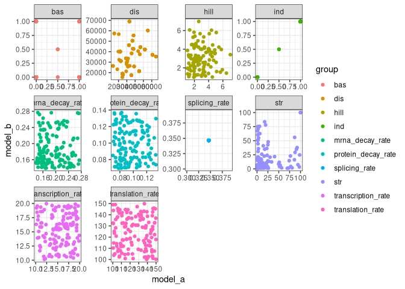
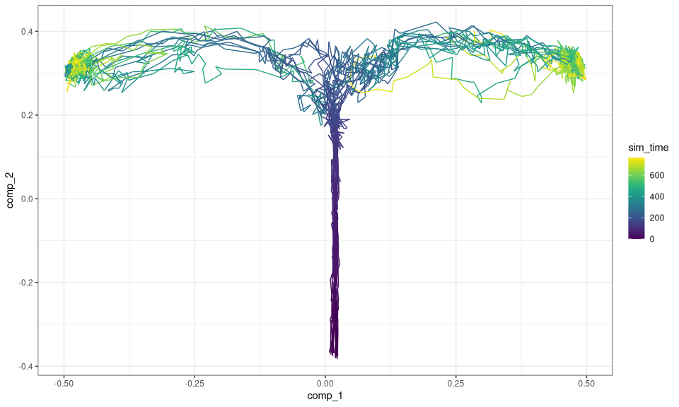
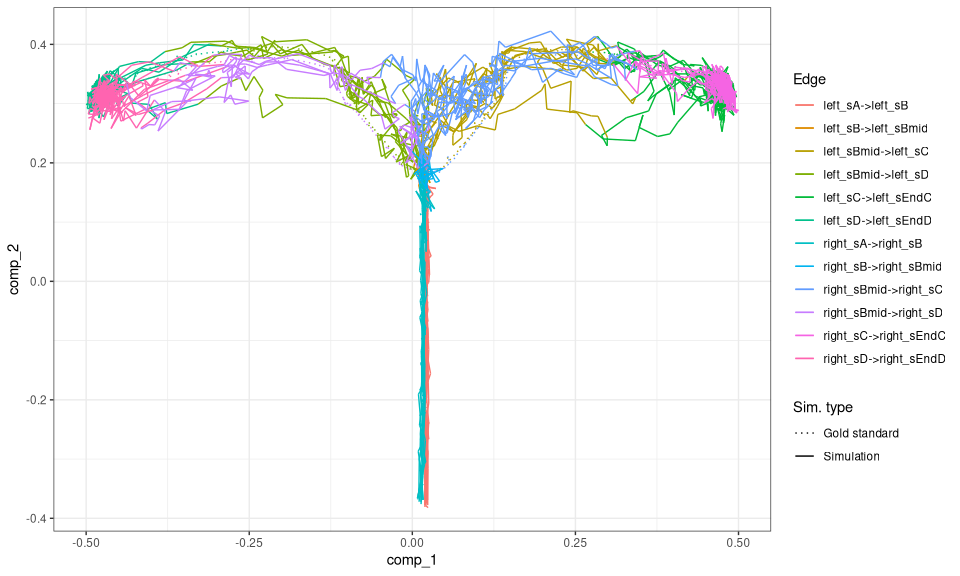
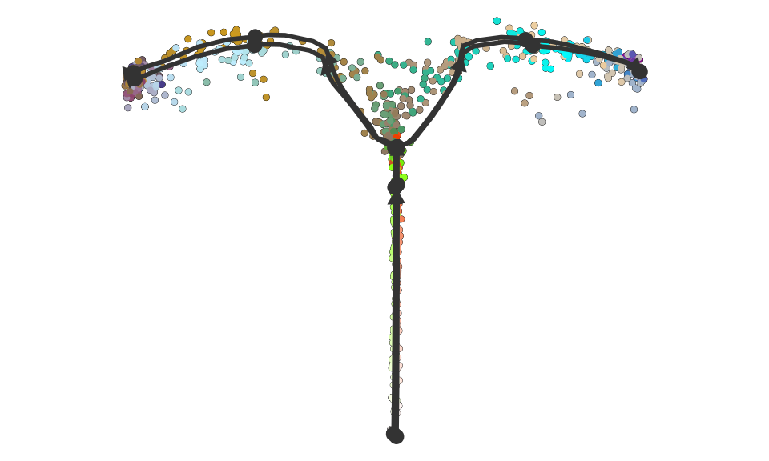
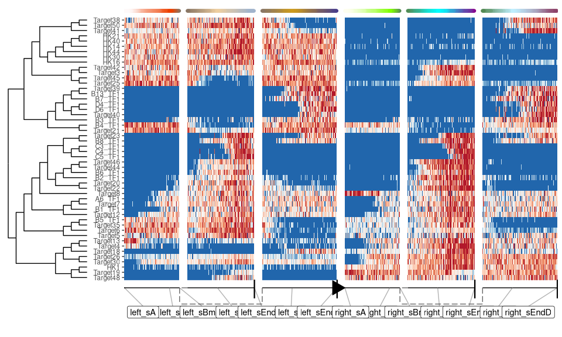

Advanced: Simulating batch effects
================

<!-- github markdown built using 
rmarkdown::render("vignettes/simulating_batch_effects.Rmd", output_format = rmarkdown::github_document())
-->

An easy way of simulating batch effects is by performing multiple dyngen
runs, but with different kinetics. dyngen samples the GRN kinetics
randomly from a set of predefined distributions (See
`?generate_kinetics`).

## Create underlying gene regulatory network

First, create the ‘common’ part of the dyngen simulation as follows.
This will ensure that the gene regulatory network-part of the simulation
is exactly the same.

``` r
library(tidyverse)
library(dyngen)

set.seed(1)

backbone <- backbone_bifurcating()
config <-
  initialise_model(
    backbone = backbone,
    num_cells = 1000,
    num_tfs = nrow(backbone$module_info),
    num_targets = 250,
    num_hks = 250,
    simulation_params = simulation_default(
      census_interval = 10, 
      ssa_algorithm = ssa_etl(tau = 300 / 3600),
      experiment_params = simulation_type_wild_type(num_simulations = 100)
    )
  )
```

``` r
# the simulation is being sped up because rendering all vignettes with one core
# for pkgdown can otherwise take a very long time
set.seed(1)

config <-
  initialise_model(
    backbone = backbone,
    num_cells = 1000,
    num_tfs = nrow(backbone$module_info),
    num_targets = 50,
    num_hks = 50,
    verbose = interactive(),
    download_cache_dir = tools::R_user_dir("dyngen", "data"),
    simulation_params = simulation_default(
      census_interval = 5, 
      ssa_algorithm = ssa_etl(tau = .01),
      experiment_params = simulation_type_wild_type(num_simulations = 10)
    )
  )
```

``` r
model_common <-
  config %>%
  generate_tf_network() %>%
  generate_feature_network()
```

    ## Generating TF network
    ## Sampling feature network from real network

## Simulate multiple times with different kinetics

Now you can run the simulation multiple times. Note that for each
separate run, the `generate_kinetics()` step ensures that the
thermodynamic parameters will be different (yet drawn from the same
distribution). Some values for the kinetics of the main transcription
factors are not changed, to ensure that the desired dynamic process is
obtained.

``` r
model_a <- model_common %>%
  generate_kinetics() %>%
  generate_gold_standard() %>%
  generate_cells()
```

    ## Generating kinetics for 135 features
    ## Generating formulae
    ## Generating gold standard mod changes
    ## Precompiling reactions for gold standard
    ## Running gold simulations
    ##   |                                                  | 0 % elapsed=00s     |========                                          | 14% elapsed=00s, remaining~01s  |===============                                   | 29% elapsed=00s, remaining~01s  |======================                            | 43% elapsed=01s, remaining~01s  |=============================                     | 57% elapsed=01s, remaining~01s  |====================================              | 71% elapsed=01s, remaining~00s  |===========================================       | 86% elapsed=01s, remaining~00s  |==================================================| 100% elapsed=01s, remaining~00s
    ## Precompiling reactions for simulations
    ## Running 10 simulations
    ## Mapping simulations to gold standard
    ## Performing dimred

``` r
model_b <- model_common %>%
  generate_kinetics() %>%
  generate_gold_standard() %>%
  generate_cells()
```

    ## Generating kinetics for 135 features
    ## Generating formulae
    ## Generating gold standard mod changes
    ## Precompiling reactions for gold standard
    ## Running gold simulations
    ##   |                                                  | 0 % elapsed=00s     |========                                          | 14% elapsed=00s, remaining~01s  |===============                                   | 29% elapsed=00s, remaining~01s  |======================                            | 43% elapsed=01s, remaining~01s  |=============================                     | 57% elapsed=01s, remaining~01s  |====================================              | 71% elapsed=01s, remaining~00s  |===========================================       | 86% elapsed=01s, remaining~00s  |==================================================| 100% elapsed=01s, remaining~00s
    ## Precompiling reactions for simulations
    ## Running 10 simulations
    ## Mapping simulations to gold standard
    ## Performing dimred

The differences if kinetics parameters can be visualised as follows.

``` r
params_a <- 
  dyngen:::.kinetics_extract_parameters_as_df(model_a$feature_info, model_a$feature_network) %>% 
  select(id, group = param, model_a = value)

params_b <- 
  dyngen:::.kinetics_extract_parameters_as_df(model_b$feature_info, model_b$feature_network) %>% 
  select(id, group = param, model_b = value)

params_ab <-
  inner_join(params_a, params_b, by = c("id", "group"))

ggplot(params_ab) + 
  geom_point(aes(model_a, model_b, colour = group)) + 
  facet_wrap(~group, scales = "free") +
  theme_bw()
```

<!-- -->

## Combine outputs and visualise

Finally, combine the simulations as follows.

``` r
model_ab <-
  combine_models(list(left = model_a, right = model_b)) %>% 
  generate_experiment()
```

    ## Merging model 1/2 left
    ## Merging model 2/2 right
    ## Recomputing dimred
    ## Simulating experiment

Show a dimensionality reduction.

``` r
plot_simulations(model_ab)
```

<!-- -->

``` r
plot_gold_mappings(model_ab, do_facet = FALSE)
```

<!-- -->

Visualise the dataset using dyno.

``` r
library(dyno)
```

    ## Loading required package: dynfeature

    ## Loading required package: dynguidelines

    ## Loading required package: dynmethods

    ## Loading required package: dynplot

    ## Loading required package: dynwrap

``` r
dataset <- as_dyno(model_ab)
plot_dimred(dataset)
```

    ## Coloring by milestone

    ## Using milestone_percentages from trajectory

<!-- -->

``` r
plot_heatmap(dataset, features_oi = 50)
```

    ## No features of interest provided, selecting the top 50 features automatically

    ## Using dynfeature for selecting the top 50 features

    ## root cell or milestone not provided, trying first outgoing milestone_id

    ## Using 'left_sA' as root

    ## Coloring by milestone

<!-- -->

## Additional thoughts

It’s definitely possible to think of different ways of simulating batch
effects. For instance, you could implement a different strategy for
changing the kinetics parameters between runs. You could also change the
gene regulatory network itself, e.g. by changing the effect of some of
the edges, or changing the targets of certain regulators.

If you come up with something, feel free to let us know on GitHub!
