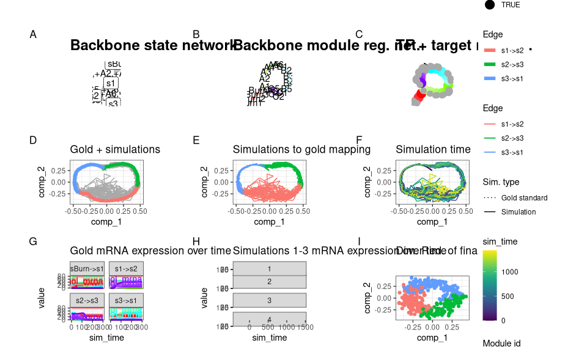
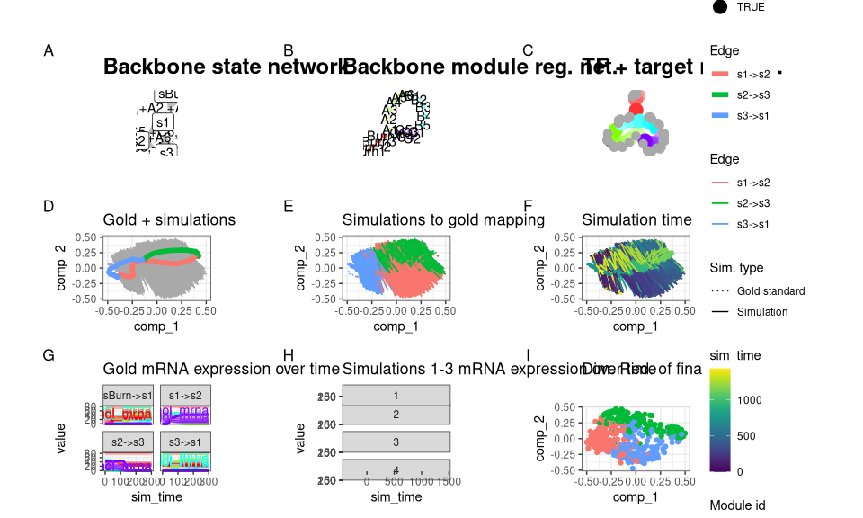
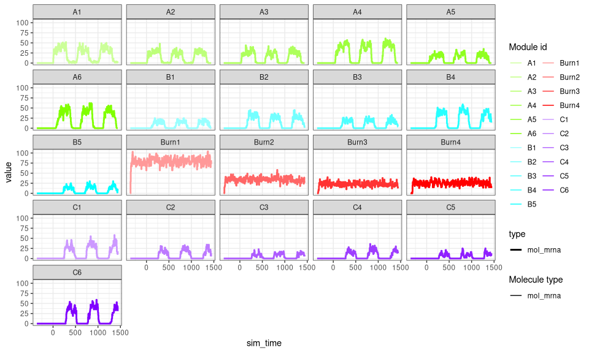
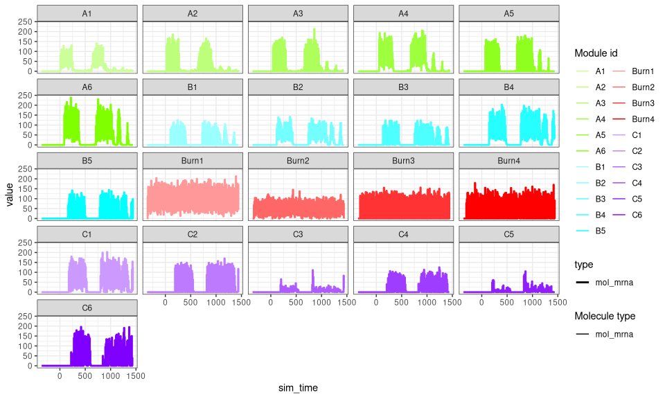
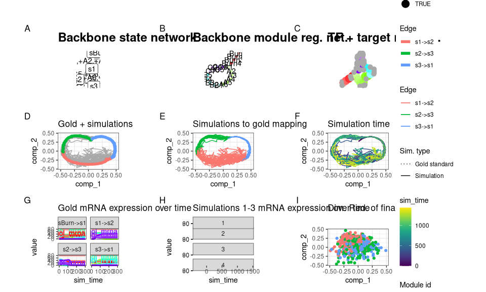
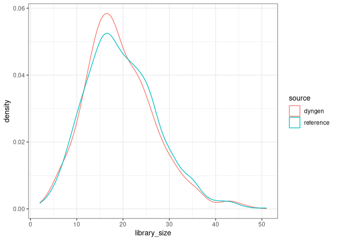

Advanced: Tweaking parameters
================

<!-- github markdown built using 
rmarkdown::render("vignettes/tweaking_parameters.Rmd", output_format = rmarkdown::github_document())
-->

In some of the other vignettes, we tweak the values for
`census_interval` and `tau` to speed up dyngen simulations. In this
vignette, we demonstrate what happens when some of the commonly tweaked
parameters are pushed too far.

## Initial run

Let’s start off with a simple bifurcating cycle run and default
parameters.

``` r
library(dyngen)
library(tidyverse)

set.seed(1)

backbone <- backbone_cycle()

num_cells <- 500
num_features <- 100

# genes are divided up such that there are nrow(module_info) TFs and
# the rest is split between targets and HKs evenly.
num_tfs <- nrow(backbone$module_info)
num_targets <- round((num_features - num_tfs) / 2)
num_hks <- num_features - num_targets - num_tfs

run1_config <- 
  initialise_model(
    backbone = backbone,
    num_tfs = num_tfs,
    num_targets = num_targets,
    num_hks = num_hks,
    num_cells = num_cells,
    verbose = FALSE
  )
```

``` r
# the simulation is being sped up because rendering all vignettes with one core
# for pkgdown can otherwise take a very long time
set.seed(1)

run1_config <-
  initialise_model(
    backbone = backbone,
    num_tfs = num_tfs,
    num_targets = num_targets,
    num_hks = num_hks,
    num_cells = num_cells,
    verbose = interactive(),
    download_cache_dir = tools::R_user_dir("dyngen", "data"),
    simulation_params = simulation_default(
      census_interval = 5, 
      ssa_algorithm = ssa_etl(tau = 300/3600),
      experiment_params = simulation_type_wild_type(num_simulations = 10)
    )
  )
```

``` r
run1 <- generate_dataset(run1_config, make_plots = TRUE)
```

    ## Generating TF network
    ## Sampling feature network from real network
    ## Generating kinetics for 100 features
    ## Generating formulae
    ## Generating gold standard mod changes
    ## Precompiling reactions for gold standard
    ## Running gold simulations
    ##   |                                                  | 0 % elapsed=00s     |=============                                     | 25% elapsed=00s, remaining~00s  |=========================                         | 50% elapsed=00s, remaining~00s  |======================================            | 75% elapsed=00s, remaining~00s  |==================================================| 100% elapsed=01s, remaining~00s
    ## Precompiling reactions for simulations
    ## Running 10 simulations
    ## Mapping simulations to gold standard
    ## Performing dimred
    ## Simulating experiment
    ## Wrapping dataset
    ## Making plots

``` r
run1$plot
```

<!-- -->

We tweaked some of the parameters by running this particular backbone
once with `num_cells = 100` and `num_features = 100` and verifying that
the new parameters still yield the desired outcome. The parameters we
tweaked are:

-   On average, 10 cells are sampled per simulation
    (e.g. `num_simulations = 100` and `num_cells = 1000`). You could
    increase this ratio to get a better cell count yield from a given
    set of simulations, but cells from the same simulation that are
    temporally close will have highly correlated expression profiles.
-   Increased time steps `tau`. This will make the Gillespie algorithm
    slighty faster but might result in unexpected artifacts in the
    simulated data.
-   `census_interval` increased from 4 to 10. This will cause dyngen to
    store an expression profile only every 10 time units. Since the
    total simulation time is xxx, each simulation will result in yyy
    data points. Note that on average only 10 data points are sampled
    per simulation.

## Increasing time step `tau`

The `tau` parameter changes the size of the time steps made by dyngen
during the simulation. Setting `tau` too large might cause certain
production and degradation of molecules to fluctuate strangely.

``` r
run2_config <- 
  initialise_model(
    backbone = backbone,
    num_tfs = num_tfs,
    num_targets = num_targets,
    num_hks = num_hks,
    num_cells = num_cells,
    gold_standard_params = gold_standard_default(tau = 1),
    simulation_params = simulation_default(ssa_algorithm = ssa_etl(tau = 5)),
    verbose = FALSE
  )
```

``` r
# the simulation is being sped up because rendering all vignettes with one core
# for pkgdown can otherwise take a very long time
set.seed(1)

run2_config <-
  initialise_model(
    backbone = backbone,
    num_tfs = num_tfs,
    num_targets = num_targets,
    num_hks = num_hks,
    num_cells = num_cells,
    verbose = interactive(),
    download_cache_dir = tools::R_user_dir("dyngen", "data"),
    gold_standard_params = gold_standard_default(tau = 1),
    simulation_params = simulation_default(
      census_interval = 5, 
      ssa_algorithm = ssa_etl(tau = 5),
      experiment_params = simulation_type_wild_type(num_simulations = 10)
    )
  )
```

``` r
run2 <- generate_dataset(run2_config, make_plots = TRUE)
```

    ## Generating TF network
    ## Sampling feature network from real network
    ## Generating kinetics for 100 features
    ## Generating formulae
    ## Generating gold standard mod changes
    ## Precompiling reactions for gold standard
    ## Running gold simulations
    ##   |                                                  | 0 % elapsed=00s     |=============                                     | 25% elapsed=00s, remaining~00s  |=========================                         | 50% elapsed=00s, remaining~00s  |======================================            | 75% elapsed=00s, remaining~00s  |==================================================| 100% elapsed=00s, remaining~00s
    ## Precompiling reactions for simulations
    ## Running 10 simulations
    ## Mapping simulations to gold standard
    ## Performing dimred
    ## Simulating experiment
    ## Wrapping dataset
    ## Making plots

``` r
run2$plot
```

<!-- -->

Certainly something strange is happening here. If we compare the
expression values of the two runs, we can see that the second run
produces much higher expression counts, but also at every step the high
expression is lowered again.

``` r
plot_simulation_expression(run1$model, what = "mol_mrna", simulation_i = 1, facet = "none") + facet_wrap(~module_id)
```

<!-- -->

``` r
plot_simulation_expression(run2$model, what = "mol_mrna", simulation_i = 1, facet = "none") + facet_wrap(~module_id)
```

<!-- -->

This is caused by setting `tau` too high; when the expression a gene is
very low but the binding of a TF causes transcription to occur,
transcripts will be created. However, at the start of a time step the
gene is not expressed, so throughout the whole time step no degradation
happen. In the next time step, however, there is a large number of
transcripts, so these will quickly be degraded.

It’s recommended to set `tau` relatively low (e.g. 0.01). Setting it too
low will cause the simulation to take a long time, however.

## Controlling number of census generated

During a simulation of length `total_time`, dyngen will draw a census
every with time steps of `census_interval`. The total number of census
generated will thus be
`num_simulations * floor(total_time / census_interval)`. Ideally, the
ratio between the number of census and the number of cells sampled from
the census will be around 10. If this ratio is too high, dyngen will
spend a lot of time comparing the census to the gold standard. If the
ratio is too low, not enough census will be available for dyngen to draw
cells from and a warning will be produced.

Controlling the ratio
`num_simulations * floor(total_time / census_interval) / num_cells` can
be performed by tweaking the `census_interval`.

``` r
run3_config <- 
  initialise_model(
    backbone = backbone,
    num_tfs = num_tfs,
    num_targets = num_targets,
    num_hks = num_hks,
    num_cells = 1000,
    gold_standard_params = gold_standard_default(
      census_interval = 100
    ),
    simulation_params = simulation_default(
      total_time = 1000,
      census_interval = 100,
      experiment_params = simulation_type_wild_type(
        num_simulations = 10
      )
    ),
    verbose = FALSE
  )
```

    ## Warning in initialise_model(backbone = backbone, num_tfs = num_tfs, num_targets = num_targets, : Simulations will not generate enough cells to draw num_cells from.
    ## Ideally, `floor(total_time / census_interval) * num_simulations / num_cells` should be larger than 10
    ## Lower the census interval or increase the number of simulations (with simulation_params$experiment_params).

In the example above, dyngen will sample each of the 10 simulations 10
times, resulting in only 100 census generated by dyngen. We can’t draw
1000 cells from 100 census, so dyngen will complain before even running
the simulation.

## Reference datasets: garbage in, garbage out

Reference expression datasets are used to modify the gene expression
counts. If you want to mimic the expression characteristics of a
specific single-cell platform you can provide your own reference
datasets. Be aware that the Garbage In, Garbage Out applies – low
quality reference datasets will negatively impact the final dataset
created.

``` r
reference_dataset <- Matrix::rsparsematrix(
  nrow = 1000, 
  ncol = 1000, 
  density = .01, 
  rand.x = function(n) rbinom(n, 20, .1)
) %>% Matrix::drop0()

run4_config <- 
  initialise_model(
    backbone = backbone,
    num_tfs = num_tfs,
    num_targets = num_targets,
    num_hks = num_hks,
    num_cells = num_cells,
    experiment_params = experiment_snapshot(
      realcount = reference_dataset
    ),
    verbose = FALSE
  )
```

``` r
# the simulation is being sped up because rendering all vignettes with one core
# for pkgdown can otherwise take a very long time
set.seed(1)

run4_config <-
  initialise_model(
    backbone = backbone,
    num_tfs = num_tfs,
    num_targets = num_targets,
    num_hks = num_hks,
    num_cells = num_cells,
    verbose = interactive(),
    download_cache_dir = tools::R_user_dir("dyngen", "data"),
    simulation_params = simulation_default(
      census_interval = 5, 
      ssa_algorithm = ssa_etl(tau = 300/3600),
      experiment_params = simulation_type_wild_type(num_simulations = 10)
    ),
    experiment_params = experiment_snapshot(
      realcount = reference_dataset
    )
  )
```

``` r
run4 <- generate_dataset(run4_config, make_plots = TRUE)
```

    ## Generating TF network
    ## Sampling feature network from real network
    ## Generating kinetics for 100 features
    ## Generating formulae
    ## Generating gold standard mod changes
    ## Precompiling reactions for gold standard
    ## Running gold simulations
    ##   |                                                  | 0 % elapsed=00s     |=============                                     | 25% elapsed=00s, remaining~00s  |=========================                         | 50% elapsed=00s, remaining~00s  |======================================            | 75% elapsed=00s, remaining~00s  |==================================================| 100% elapsed=01s, remaining~00s
    ## Precompiling reactions for simulations
    ## Running 10 simulations
    ## Mapping simulations to gold standard
    ## Performing dimred
    ## Simulating experiment
    ## Wrapping dataset
    ## Making plots

``` r
run4$plot
```

<!-- -->

Notice how the last plot in the previous figure looks like total noise?
This is because the reference dataset had very low library sizes for
each of the ‘cells’ and dyngen attempts to match this as close as
possible.

``` r
library_size_reference <- Matrix::rowSums(reference_dataset)
library_size_dyngen <- Matrix::rowSums(run4$dataset$counts)

dat <- bind_rows(
  tibble(source = "reference", library_size = library_size_reference),
  tibble(source = "dyngen", library_size = library_size_dyngen)
)
ggplot(dat) + geom_density(aes(library_size, colour = source)) + theme_bw()
```

<!-- -->
