Getting started
================

<!-- github markdown built using 
rmarkdown::render("vignettes/getting_started.Rmd", output_format = rmarkdown::github_document())
-->

This vignette demonstrates the basics of running a dyngen simulation. If
you haven’t done so already, first check out the installation
instructions in the README.

## Step 1: Define backbone and other parameters

A dyngen simulation can be started by providing a backbone to the
`initialise_model()` function. The backbone of a `dyngen` model is what
determines the overall dynamic process that a cell will undergo during a
simulation. It consists of a set of gene modules, which regulate
eachother in such a way that expression of certain genes change over
time in a specific manner.

``` r
library(tidyverse)
library(dyngen)

set.seed(1)

backbone <- backbone_bifurcating()
config <- 
  initialise_model(
    backbone = backbone,
    num_tfs = nrow(backbone$module_info),
    num_targets = 500,
    num_hks = 500,
    verbose = FALSE
  )
```

``` r
# the simulation is being sped up because rendering all vignettes with one core
# for pkgdown can otherwise take a very long time
set.seed(1)

config <-
  initialise_model(
    backbone = backbone,
    num_cells = 1000,
    num_tfs = nrow(backbone$module_info),
    num_targets = 50,
    num_hks = 50,
    verbose = FALSE,
    download_cache_dir = tools::R_user_dir("dyngen", "data"),
    simulation_params = simulation_default(
      total_time = 1000,
      census_interval = 2, 
      ssa_algorithm = ssa_etl(tau = 300/3600),
      experiment_params = simulation_type_wild_type(num_simulations = 10)
    )
  )
```

``` r
plot_backbone_statenet(config)
```

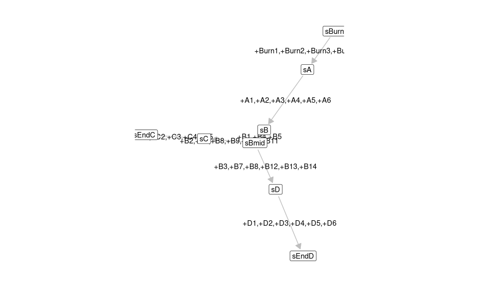<!-- -->

``` r
plot_backbone_modulenet(config)
```

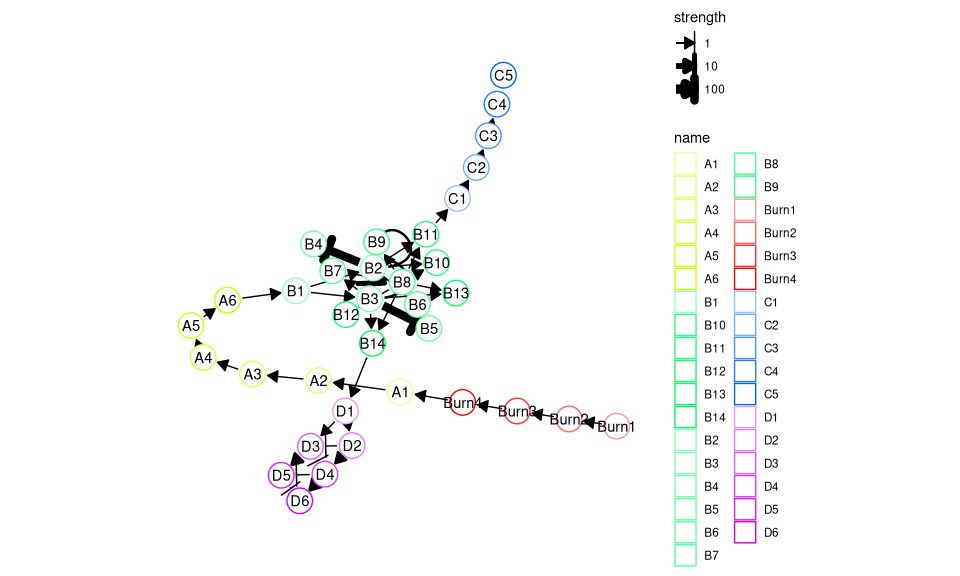<!-- -->

For backbones with all different sorts of topologies, check
`list_backbones()`:

``` r
names(list_backbones())
```

    ##  [1] "bifurcating"             "bifurcating_converging"  "bifurcating_cycle"       "bifurcating_loop"        "binary_tree"             "branching"               "consecutive_bifurcating" "converging"             
    ##  [9] "cycle"                   "cycle_simple"            "disconnected"            "linear"                  "linear_simple"           "trifurcating"

## Step 2: Generate transcription factors (TFs)

Each gene module consists of a set of transcription factors. These can
be generated and visualised as follows.

``` r
model <- generate_tf_network(config)
plot_feature_network(model, show_targets = FALSE)
```

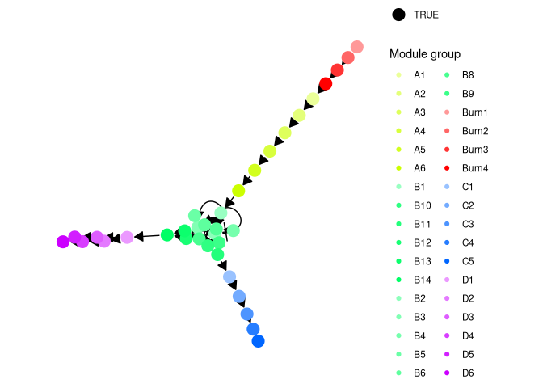<!-- -->

## Step 3: Sample target genes and housekeeping genes (HKs)

Next, target genes and housekeeping genes are added to the network by
sampling a gold standard gene regulatory network using the Page Rank
algorithm. Target genes are regulated by TFs or other target genes,
while HKs are only regulated by themselves.

``` r
model <- generate_feature_network(model)
plot_feature_network(model)
```

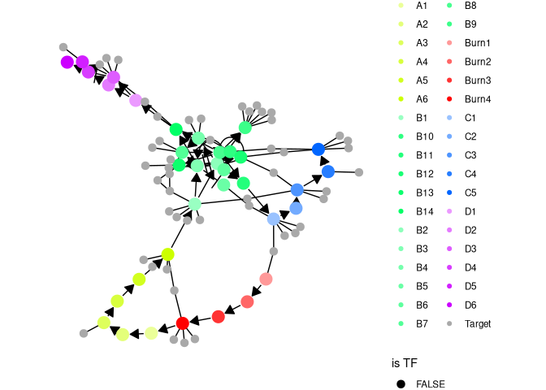<!-- -->

``` r
plot_feature_network(model, show_hks = TRUE)
```

<!-- -->

## Step 4: Generate kinetics

Note that the target network does not show the effect of some
interactions, because these are generated along with other kinetics
parameters of the SSA simulation.

``` r
model <- generate_kinetics(model)
plot_feature_network(model)
```

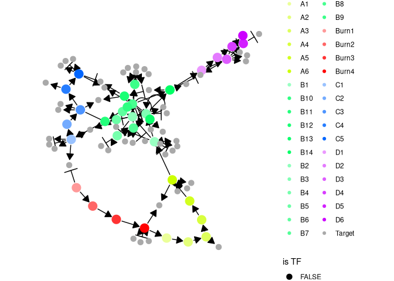<!-- -->

``` r
plot_feature_network(model, show_hks = TRUE)
```

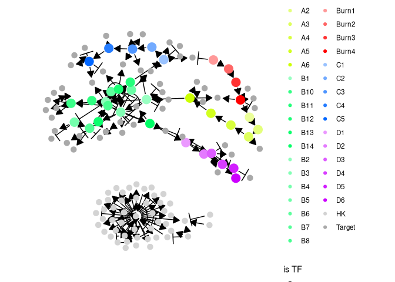<!-- -->

## Step 5: Simulate gold standard

The gold standard is simulated by enabling certain parts of the module
network and performing ODE simulations. The gold standard are visualised
by performing a dimensionality reduction on the mRNA expression values.

``` r
model <- generate_gold_standard(model)
```

``` r
plot_gold_simulations(model) + scale_colour_brewer(palette = "Dark2")
```

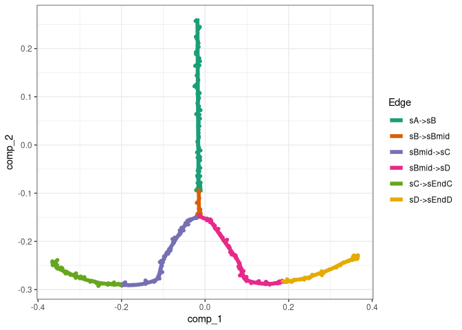<!-- -->

The expression of the modules (average of TFs) can be visualised as
follows.

``` r
plot_gold_expression(model, what = "mol_mrna") # mrna
```

<!-- -->

``` r
plot_gold_expression(model, label_changing = FALSE) # premrna, mrna, and protein
```

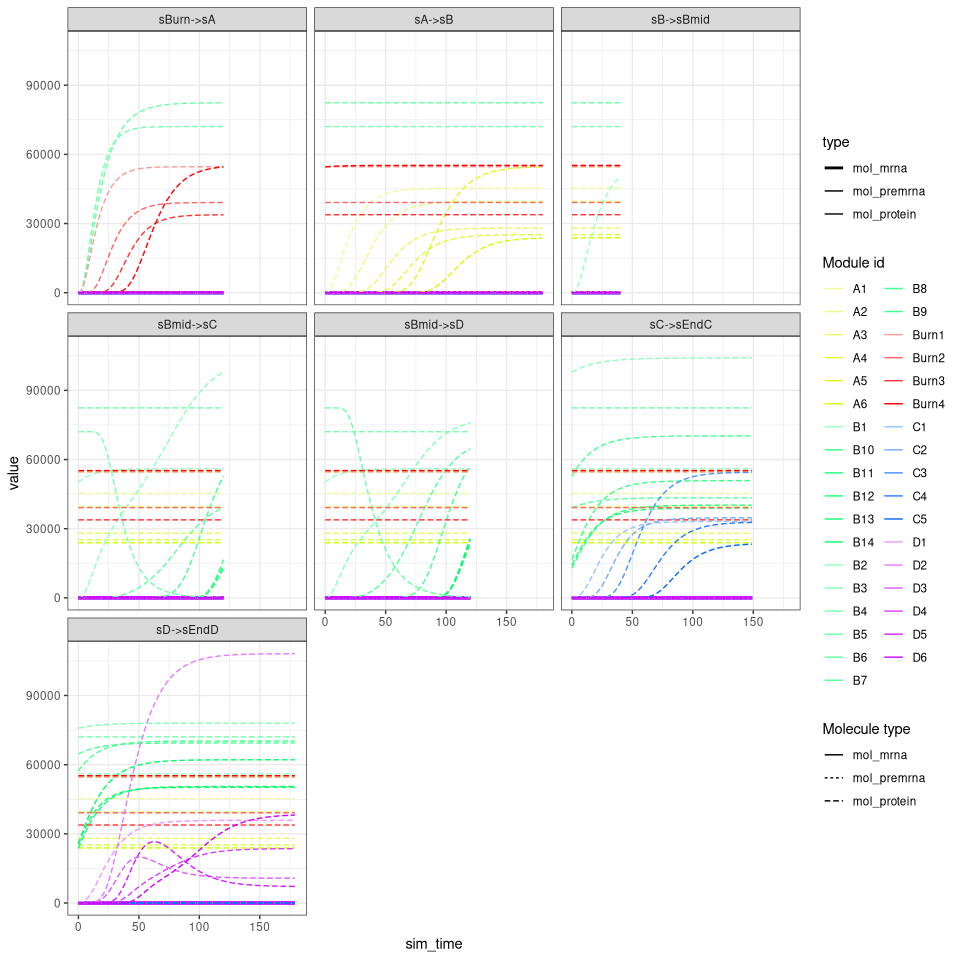<!-- -->

## Step 6: Simulate cells.

Cells are simulated by running SSA simulations. The simulations are
again using dimensionality reduction.

``` r
model <- generate_cells(model)
plot_simulations(model)
```

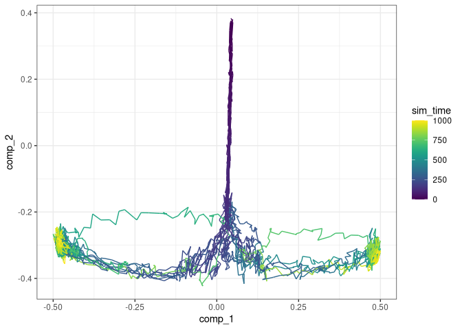<!-- -->

The gold standard can be overlayed on top of the simulations.

``` r
plot_gold_simulations(model) + scale_colour_brewer(palette = "Dark2")
```

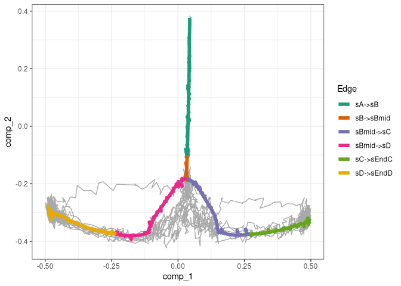<!-- -->

We can check how each segment of a simulation is mapped to the gold
standard.

``` r
plot_gold_mappings(model, do_facet = FALSE) + scale_colour_brewer(palette = "Dark2")
```

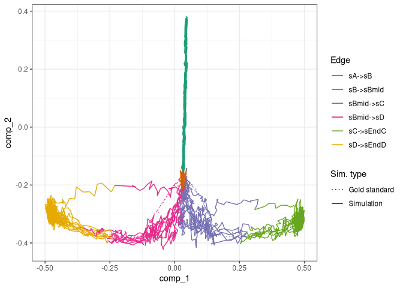<!-- -->

The expression of the modules (average of TFs) of a single simulation
can be visualised as follows.

``` r
plot_simulation_expression(model, 1:4, what = "mol_mrna")
```

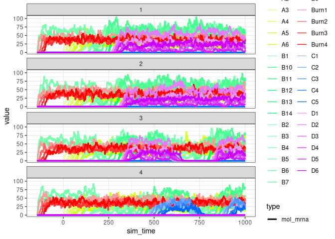<!-- -->

## Step 7: Experiment emulation

Effects from performing a single-cell RNA-seq experiment can be emulated
as follows.

``` r
model <- generate_experiment(model)
```

## Step 8: Convert to a dyno object

Converting the dyngen to a dyno object allows you to visualise the
dataset using the `dynplot` functions, or infer trajectories using
`dynmethods`.

``` r
dataset <- as_dyno(model)
```

### Visualise with `dynplot`

``` r
library(dynplot)
plot_dimred(dataset)
```

    ## Coloring by milestone

    ## Using milestone_percentages from trajectory

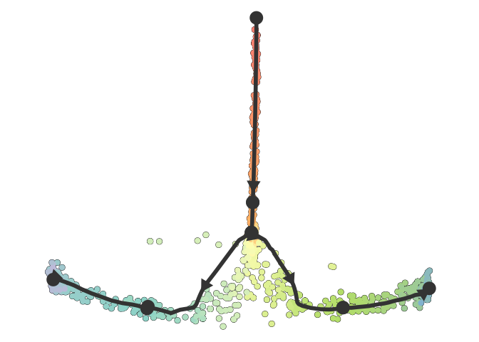<!-- -->

``` r
plot_graph(dataset)
```

    ## Coloring by milestone
    ## Using milestone_percentages from trajectory

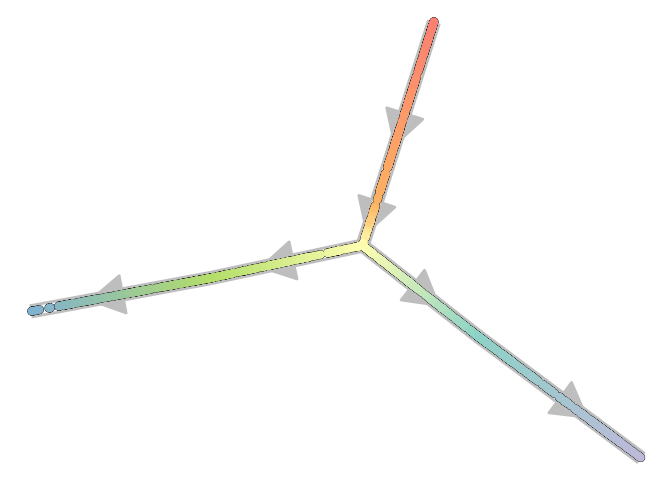<!-- -->

### Save output to file

You can save the output of the model and/or dataset to a file as
follows.

``` r
write_rds(model, "model.rds", compress = "gz")
write_rds(dataset, "dataset.rds", compress = "gz")
```

## Step 8 alternative: Convert to an anndata/SCE/Seurat object

dyngen 1.0.0 allows converting the output to an `anndata`, `SCE` or
`Seurat` object as well. Check out the [anndata
documentation](https://cran.r-project.org/package=anndata) on how to
install anndata for R.

``` r
library(anndata)
ad <- as_anndata(model)
ad$write_h5ad("dataset.h5ad")

library(SingleCellExperiment)
sce <- as_sce(model)
write_rds(sce, "dataset_sce.rds")

library(Seurat)
seurat <- as_seurat(model)
write_rds(seurat, "dataset_seurat.rds")
```

# One-shot function

`dyngen` also provides a one-shot function for running all of the steps
all at once and producing plots.

``` r
out <- generate_dataset(
  config,
  format = "dyno",
  make_plots = TRUE
)
```

``` r
dataset <- out$dataset
model <- out$model
print(out$plot)
```

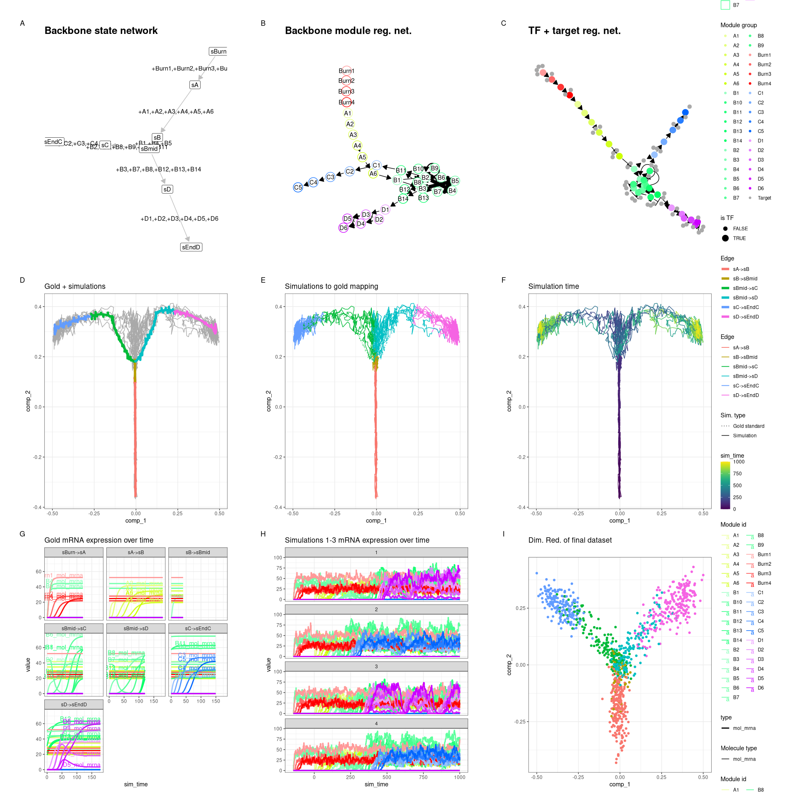<!-- -->

`dataset` and `model` can be used in much the same way as before.

``` r
library(dyno)
```

    ## Loading required package: dynfeature

    ## Loading required package: dynguidelines

    ## Loading required package: dynmethods

    ## Loading required package: dynwrap

``` r
plot_dimred(dataset)
```

    ## Coloring by milestone

    ## Using milestone_percentages from trajectory

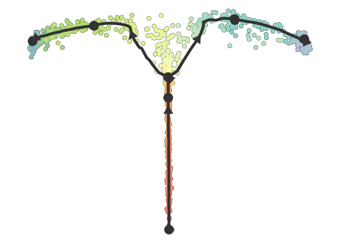<!-- -->

``` r
plot_graph(dataset)
```

    ## Coloring by milestone
    ## Using milestone_percentages from trajectory

<!-- -->
