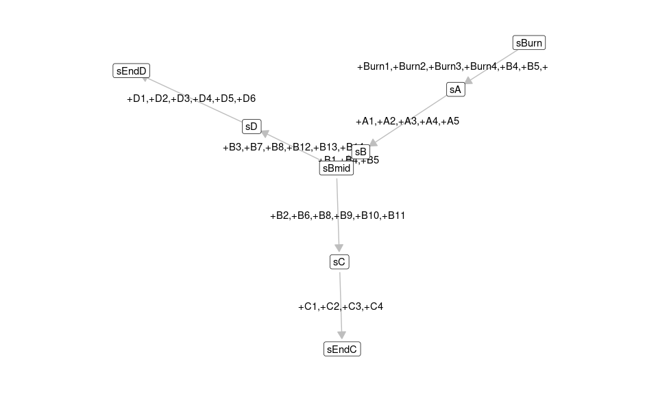
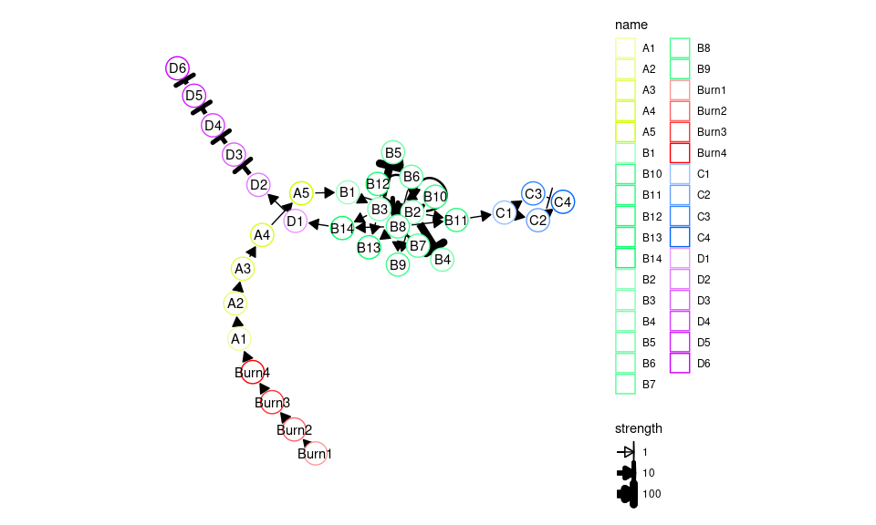
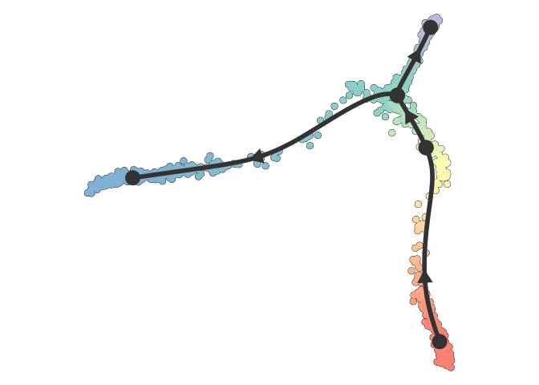
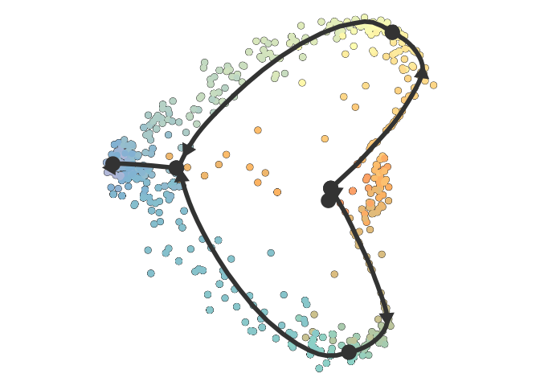
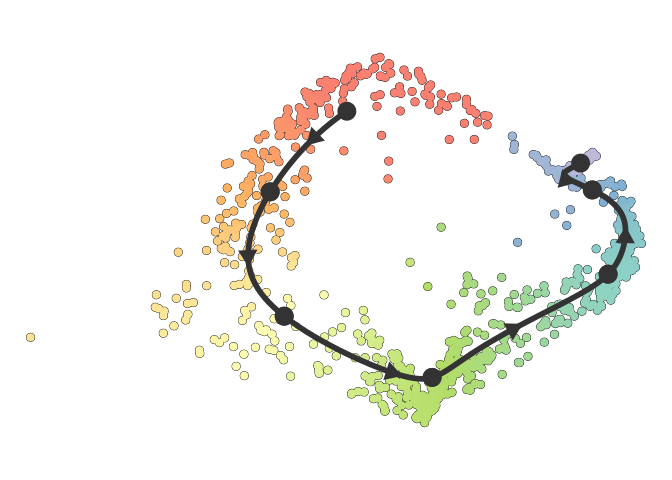

Getting started
================

<!-- github markdown built using 
rmarkdown::render("vignettes/getting_started.Rmd", output_format = rmarkdown::github_document(html_preview = FALSE))
-->

This vignette demonstrates the basics of running a dyngen simulation. If
you haven’t done so already, first check out the installation
instructions in the README.

## Step 1: Define backbone and other parameters

A dyngen simulation can be started by providing a backbone to the
`initialise_model()` function. The backbone of a `dyngen` model is what
determines the overall dynamic process that a cell will undergo during a
simulation. It consists of a set of gene modules, which regulate
eachother in such a way that expression of certain genes change over
time in a specific manner.

``` r
library(tidyverse)
library(dyngen)

set.seed(10)
model <- 
  initialise_model(
    num_tfs = 12,
    num_targets = 30,
    num_hks = 15,
    backbone = backbone_bifurcating(),
    verbose = TRUE
  )

plot_backbone_statenet(model)
```

<!-- -->

``` r
plot_backbone_modulenet(model)
```

<!-- -->

For backbones with all different sorts of topologies, check
`list_backbones()`:

``` r
names(list_backbones())
```

    ##  [1] "bifurcating"             "bifurcating_converging"  "bifurcating_cycle"       "bifurcating_loop"        "binary_tree"             "branching"               "consecutive_bifurcating" "converging"              "cycle"                  
    ## [10] "cycle_simple"            "disconnected"            "linear"                  "linear_simple"           "trifurcating"

## Step 2: Generate transcription factors (TFs)

Each gene module consists of a set of transcription factors. These can
be generated and visualised as follows.

``` r
model <- generate_tf_network(model)
```

    ## Generating TF network

``` r
plot_feature_network(model, show_targets = FALSE)
```

<!-- -->

## Step 3: Sample target genes and housekeeping genes (HKs)

Next, target genes and housekeeping genes are added to the network by
sampling a gold standard gene regulatory network using the Page Rank
algorithm. Target genes are regulated by TFs or other target genes,
while HKs are only regulated by themselves.

``` r
model <- generate_feature_network(model)
```

    ## Sampling feature network from real network

``` r
plot_feature_network(model)
```

<!-- -->

``` r
plot_feature_network(model, show_hks = TRUE)
```

<!-- -->

## Step 4: Generate kinetics

Note that the target network does not show the effect of some
interactions, because these are generated along with other kinetics
parameters of the SSA simulation.

``` r
model <- generate_kinetics(model)
```

    ## Generating kinetics for 78 features
    ## Generating formulae

``` r
plot_feature_network(model)
```

<!-- -->

``` r
plot_feature_network(model, show_hks = TRUE)
```

<!-- -->

## Step 5: Simulate gold standard

The gold standard is simulated by enabling certain parts of the module
network and performing ODE simulations. The gold standard are visualised
by performing a dimensionality reduction on the mRNA expression values.

``` r
model <- generate_gold_standard(model)
```

    ## Generating gold standard mod changes
    ## Precompiling reactions for gold standard
    ## Running gold simulations
    ##   |                                                  | 0 % elapsed=00s     |========                                          | 14% elapsed=00s, remaining~01s  |===============                                   | 29% elapsed=00s, remaining~01s  |======================                            | 43% elapsed=00s, remaining~00s  |=============================                     | 57% elapsed=00s, remaining~00s  |====================================              | 71% elapsed=00s, remaining~00s  |===========================================       | 86% elapsed=01s, remaining~00s  |==================================================| 100% elapsed=01s, remaining~00s

``` r
plot_gold_simulations(model) + scale_colour_brewer(palette = "Dark2")
```

<!-- -->

The expression of the modules (average of TFs) can be visualised as
follows.

``` r
plot_gold_expression(model, what = "mol_mrna") # mrna
```

<!-- -->

``` r
plot_gold_expression(model, label_changing = FALSE) # premrna, mrna, and protein
```

<!-- -->

## Step 6: Simulate cells.

Cells are simulated by running SSA simulations. The simulations are
again using dimensionality reduction.

``` r
model <- generate_cells(model)
```

    ## Precompiling reactions for simulations
    ## Running 32 simulations
    ## Mapping simulations to gold standard
    ## Performing dimred

``` r
plot_simulations(model)
```

<!-- -->

The gold standard can be overlayed on top of the simulations.

``` r
plot_gold_simulations(model) + scale_colour_brewer(palette = "Dark2")
```

<!-- -->

We can check how each segment of a simulation is mapped to the gold
standard.

``` r
plot_gold_mappings(model, do_facet = FALSE) + scale_colour_brewer(palette = "Dark2")
```

<!-- -->

The expression of the modules (average of TFs) of a single simulation
can be visualised as follows.

``` r
plot_simulation_expression(model, 1:4, what = "mol_mrna")
```

<!-- -->

## Step 7: Experiment emulation

Effects from performing a single-cell RNA-seq experiment can be emulated
as follows.

``` r
model <- generate_experiment(model)
```

    ## Simulating experiment

## Step 8: Convert to a dyno object

Converting the dyngen to a dyno object allows you to visualise the
dataset using the `dynplot` functions, or infer trajectories using
`dynmethods`.

``` r
dataset <- as_dyno(model)
```

### Visualise with `dynplot`

``` r
library(dynplot)
plot_dimred(dataset)
```

    ## Coloring by milestone

    ## Using milestone_percentages from trajectory

<!-- -->

``` r
plot_graph(dataset)
```

    ## Coloring by milestone
    ## Using milestone_percentages from trajectory

<!-- -->

### Infer trajectory on expression data

``` r
library(dyno)
pred <- infer_trajectory(dataset, ti_slingshot())
```

    ## Following packages have to be installed: tislingshot
    ## Do you want to install these packages? 
    ## 1: Yes [default]
    ## 2: No

    ## Using github PAT from envvar GITHUB_PAT

    ## Skipping install of 'tislingshot' from a github remote, the SHA1 (98a7cc7f) has not changed since last install.
    ##   Use `force = TRUE` to force installation

    ## Using full covariance matrix

``` r
plot_dimred(pred)
```

    ## Coloring by milestone

    ## Using milestone_percentages from trajectory

<!-- -->

### Save output to file

You can save the output of the model and/or dataset to a file as
follows.

``` r
write_rds(model, "model.rds", compress = "gz")
write_rds(dataset, "dataset.rds", compress = "gz")
```

## Step 8 alternative: Convert to an anndata object

dyngen (&gt;= 0.4.1) allows converting the output to an `anndata` object
as well. Check out the [anndata
documentation](https://cran.r-project.org/package=anndata) on how to
install anndata for R.

``` r
library(anndata)
ad <- as_anndata(model)
ad$write_h5ad("dataset.h5ad")
```

# One-shot function

`dyngen` also provides a one-shot function for running all of the steps
all at once and producing plots.

``` r
set.seed(1)
config <- 
  initialise_model(
    num_tfs = 12,
    num_targets = 30,
    num_hks = 15,
    backbone = backbone_bifurcating_converging(),
    verbose = FALSE
  )

out <- generate_dataset(
  config,
  make_plots = TRUE
)
```

    ## Warning in selectChildren(ac[!fin], -1): error 'No child processes' in select

``` r
dataset <- out$dataset
model <- out$model
print(out$plot)
```

<!-- -->

`dataset` and `model` can be used in much the same way as before.

``` r
plot_dimred(dataset)
```

    ## Coloring by milestone

    ## Using milestone_percentages from trajectory

<!-- -->

``` r
plot_graph(dataset)
```

    ## Coloring by milestone
    ## Using milestone_percentages from trajectory

<!-- -->

``` r
pred <- infer_trajectory(dataset, ti_slingshot(), verbose = FALSE)
```

    ## Following packages have to be installed: tislingshot
    ## Do you want to install these packages? 
    ## 1: Yes [default]
    ## 2: No

    ## Using github PAT from envvar GITHUB_PAT

    ## Skipping install of 'tislingshot' from a github remote, the SHA1 (98a7cc7f) has not changed since last install.
    ##   Use `force = TRUE` to force installation

    ## Using full covariance matrix

``` r
plot_dimred(pred)
```

    ## Coloring by milestone

    ## Using milestone_percentages from trajectory

<!-- -->
