Showcase different backbones
================

<!-- github markdown built using 
rmarkdown::render("vignettes/showcase_backbones.Rmd", output_format = rmarkdown::github_document(html_preview = FALSE))
-->

``` r
library(dyngen)
```

This vignette demonstrates the different dynamic processes topologies
(e.g. bifurcating and cyclic). If you haven’t done so already, first
check out the installation instructions in the README.

You can find a full list of backbones using `?list_backbones`. This
vignette will showcase each of them individually.

# Linear

``` r
backbone <- backbone_linear()

init <- initialise_model(
  backbone = backbone,
  num_cells = 500,
  num_tfs = 100,
  num_targets = 50,
  num_hks = 25,
  simulation_params = simulation_default(census_interval = 10, ssa_algorithm = ssa_etl(tau = 300 / 3600))
)
out <- generate_dataset(init, make_plots = TRUE)
#> Generating TF network
#> Sampling feature network from real network
#> Generating kinetics for 175 features
#> Generating formulae
#> Generating gold standard mod changes
#> Precompiling reactions for gold standard
#> Running gold simulations
#>   |                                                  | 0 % elapsed=00s     |=============                                     | 25% elapsed=00s, remaining~01s  |=========================                         | 50% elapsed=01s, remaining~01s  |======================================            | 75% elapsed=01s, remaining~00s  |==================================================| 100% elapsed=01s, remaining~00s
#> Precompiling reactions for simulations
#> Running 32 simulations
#> Mapping simulations to gold standard
#> Performing dimred
#> Simulating experiment
#> Wrapping dataset
#> Making plots
out$plot
```

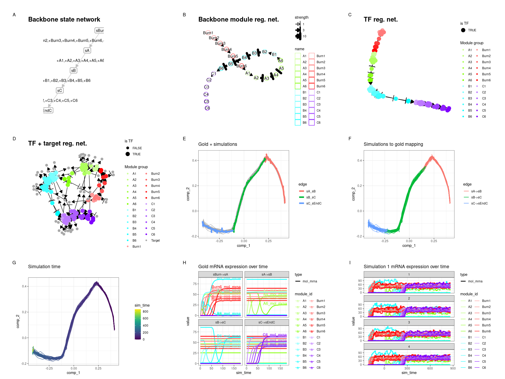<!-- -->

# Bifurcating

``` r
backbone <- backbone_bifurcating()

init <- initialise_model(
  backbone = backbone,
  num_cells = 500,
  num_tfs = 100,
  num_targets = 50,
  num_hks = 25,
  simulation_params = simulation_default(census_interval = 10, ssa_algorithm = ssa_etl(tau = 300 / 3600))
)
out <- generate_dataset(init, make_plots = TRUE)
#> Generating TF network
#> Sampling feature network from real network
#> Generating kinetics for 175 features
#> Generating formulae
#> Generating gold standard mod changes
#> Precompiling reactions for gold standard
#> Running gold simulations
#>   |                                                  | 0 % elapsed=00s     |========                                          | 14% elapsed=00s, remaining~02s  |===============                                   | 29% elapsed=01s, remaining~02s  |======================                            | 43% elapsed=01s, remaining~01s  |=============================                     | 57% elapsed=01s, remaining~01s  |====================================              | 71% elapsed=01s, remaining~01s  |===========================================       | 86% elapsed=02s, remaining~00s  |==================================================| 100% elapsed=02s, remaining~00s
#> Precompiling reactions for simulations
#> Running 32 simulations
#> Mapping simulations to gold standard
#> Warning in .generate_cells_predict_state(model): Simulation does not contain all gold standard edges. This simulation likely suffers from bad kinetics; choose a different seed and rerun.
#> Performing dimred
#> Simulating experiment
#> Wrapping dataset
#> Making plots
out$plot
```

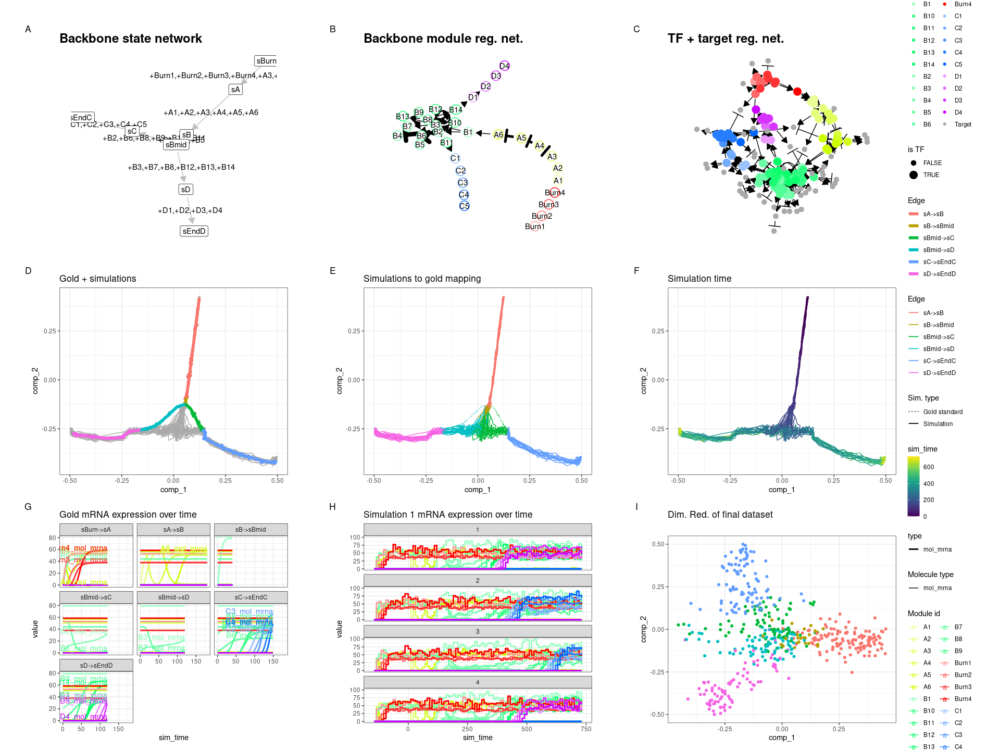<!-- -->

# Bifurcating converging

``` r
backbone <- backbone_bifurcating_converging()

init <- initialise_model(
  backbone = backbone,
  num_cells = 500,
  num_tfs = 100,
  num_targets = 50,
  num_hks = 25,
  simulation_params = simulation_default(census_interval = 10, ssa_algorithm = ssa_etl(tau = 300 / 3600))
)
out <- generate_dataset(init, make_plots = TRUE)
#> Generating TF network
#> Sampling feature network from real network
#> Generating kinetics for 175 features
#> Generating formulae
#> Generating gold standard mod changes
#> Precompiling reactions for gold standard
#> Running gold simulations
#>   |                                                  | 0 % elapsed=00s     |========                                          | 14% elapsed=00s, remaining~01s  |===============                                   | 29% elapsed=00s, remaining~00s  |======================                            | 43% elapsed=00s, remaining~00s  |=============================                     | 57% elapsed=00s, remaining~00s  |====================================              | 71% elapsed=01s, remaining~00s  |===========================================       | 86% elapsed=01s, remaining~00s  |==================================================| 100% elapsed=01s, remaining~00s
#> Precompiling reactions for simulations
#> Running 32 simulations
#> Mapping simulations to gold standard
#> Warning in .generate_cells_predict_state(model): Simulation does not contain all gold standard edges. This simulation likely suffers from bad kinetics; choose a different seed and rerun.
#> Performing dimred
#> Simulating experiment
#> Wrapping dataset
#> Making plots
out$plot
```

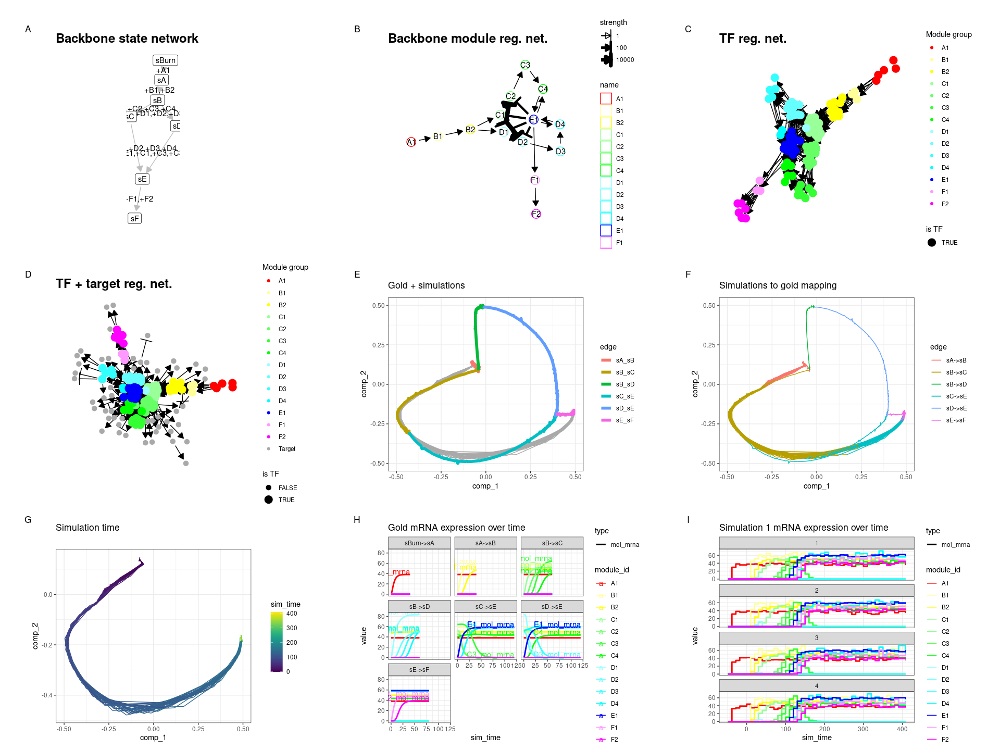<!-- -->

# Bifurcating cycle

``` r
backbone <- backbone_bifurcating_cycle()

init <- initialise_model(
  backbone = backbone,
  num_cells = 500,
  num_tfs = 100,
  num_targets = 50,
  num_hks = 25,
  simulation_params = simulation_default(census_interval = 10, ssa_algorithm = ssa_etl(tau = 300 / 3600))
)
out <- generate_dataset(init, make_plots = TRUE)
#> Generating TF network
#> Sampling feature network from real network
#> Generating kinetics for 175 features
#> Generating formulae
#> Generating gold standard mod changes
#> Precompiling reactions for gold standard
#> Running gold simulations
#>   |                                                  | 0 % elapsed=00s     |=======                                           | 12% elapsed=00s, remaining~01s  |=============                                     | 25% elapsed=00s, remaining~01s  |===================                               | 38% elapsed=00s, remaining~01s  |=========================                         | 50% elapsed=01s, remaining~01s  |================================                  | 62% elapsed=01s, remaining~01s  |======================================            | 75% elapsed=01s, remaining~00s  |============================================      | 88% elapsed=01s, remaining~00s  |==================================================| 100% elapsed=01s, remaining~00s
#> Precompiling reactions for simulations
#> Running 32 simulations
#> Mapping simulations to gold standard
#> Performing dimred
#> Simulating experiment
#> Wrapping dataset
#> Making plots
out$plot
```

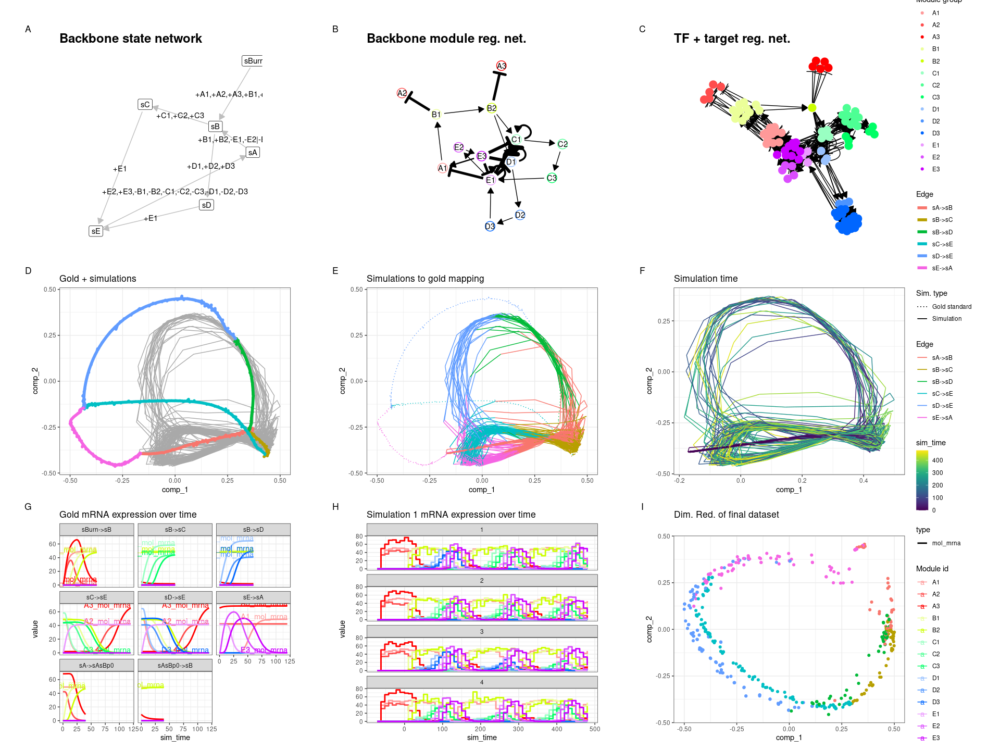<!-- -->

# Bifurcating loop

``` r
backbone <- backbone_bifurcating_loop()

init <- initialise_model(
  backbone = backbone,
  num_cells = 500,
  num_tfs = 100,
  num_targets = 50,
  num_hks = 25,
  simulation_params = simulation_default(census_interval = 10, ssa_algorithm = ssa_etl(tau = 300 / 3600))
)
out <- generate_dataset(init, make_plots = TRUE)
#> Generating TF network
#> Sampling feature network from real network
#> Generating kinetics for 175 features
#> Generating formulae
#> Generating gold standard mod changes
#> Precompiling reactions for gold standard
#> Running gold simulations
#>   |                                                  | 0 % elapsed=00s     |========                                          | 14% elapsed=00s, remaining~01s  |===============                                   | 29% elapsed=00s, remaining~01s  |======================                            | 43% elapsed=00s, remaining~01s  |=============================                     | 57% elapsed=01s, remaining~01s  |====================================              | 71% elapsed=01s, remaining~00s  |===========================================       | 86% elapsed=01s, remaining~00s  |==================================================| 100% elapsed=01s, remaining~00s
#> Precompiling reactions for simulations
#> Running 32 simulations
#> Mapping simulations to gold standard
#> Performing dimred
#> Simulating experiment
#> Wrapping dataset
#> Making plots
out$plot
```

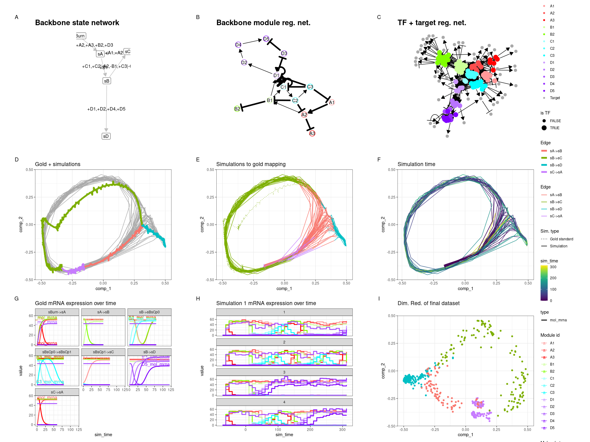<!-- -->

# Binary tree

``` r
backbone <- backbone_binary_tree(
  num_modifications = 2
)

init <- initialise_model(
  backbone = backbone,
  num_cells = 500,
  num_tfs = 100,
  num_targets = 50,
  num_hks = 25,
  simulation_params = simulation_default(census_interval = 10, ssa_algorithm = ssa_etl(tau = 300 / 3600))
)
out <- generate_dataset(init, make_plots = TRUE)
#> Generating TF network
#> Sampling feature network from real network
#> Generating kinetics for 175 features
#> Generating formulae
#> Generating gold standard mod changes
#> Precompiling reactions for gold standard
#> Running gold simulations
#>   |                                                  | 0 % elapsed=00s     |=====                                             | 8 % elapsed=00s, remaining~03s  |=========                                         | 17% elapsed=01s, remaining~03s  |=============                                     | 25% elapsed=01s, remaining~03s  |=================                                 | 33% elapsed=01s, remaining~02s  |=====================                             | 42% elapsed=01s, remaining~02s  |=========================                         | 50% elapsed=02s, remaining~02s  |==============================                    | 58% elapsed=02s, remaining~01s  |==================================                | 67% elapsed=02s, remaining~01s  |======================================            | 75% elapsed=02s, remaining~01s  |==========================================        | 83% elapsed=02s, remaining~00s  |==============================================    | 92% elapsed=03s, remaining~00s  |==================================================| 100% elapsed=03s, remaining~00s
#> Precompiling reactions for simulations
#> Running 32 simulations
#> Mapping simulations to gold standard
#> Warning in .generate_cells_predict_state(model): Simulation does not contain all gold standard edges. This simulation likely suffers from bad kinetics; choose a different seed and rerun.
#> Performing dimred
#> Simulating experiment
#> Wrapping dataset
#> Making plots
out$plot
```

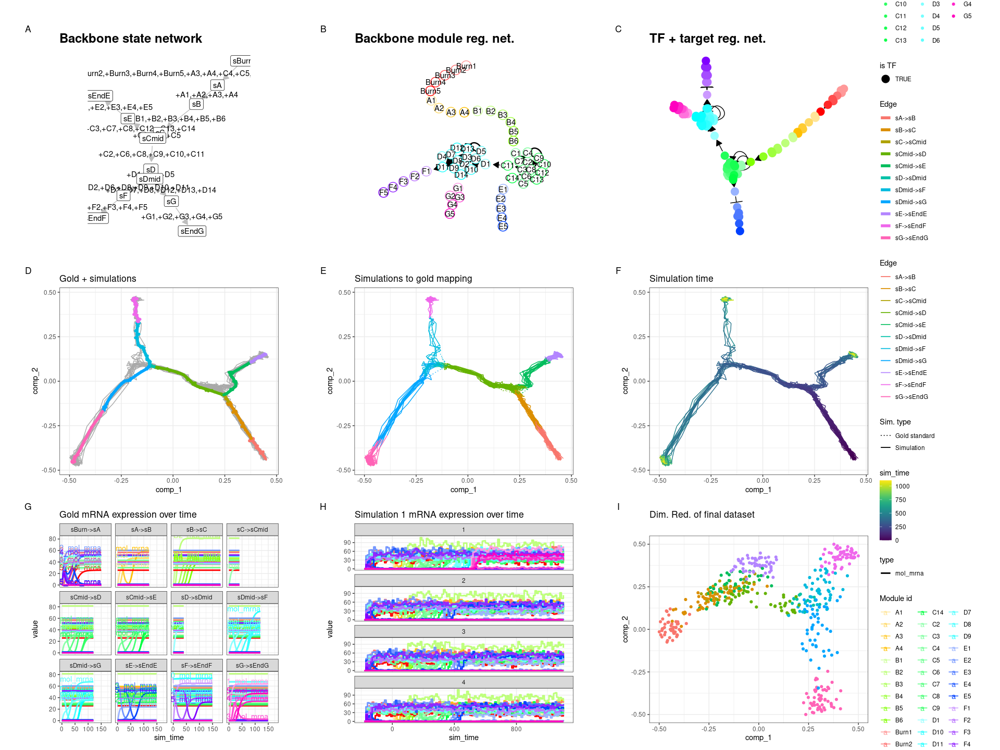<!-- -->

# Branching

``` r
backbone <- backbone_branching(
  num_modifications = 2,
  min_degree = 3,
  max_degree = 3
)

init <- initialise_model(
  backbone = backbone,
  num_cells = 500,
  num_tfs = 100,
  num_targets = 50,
  num_hks = 25,
  simulation_params = simulation_default(census_interval = 10, ssa_algorithm = ssa_etl(tau = 300 / 3600))
)
out <- generate_dataset(init, make_plots = TRUE)
#> Generating TF network
#> Sampling feature network from real network
#> Generating kinetics for 175 features
#> Generating formulae
#> Generating gold standard mod changes
#> Precompiling reactions for gold standard
#> Running gold simulations
#>   |                                                  | 0 % elapsed=00s     |=====                                             | 8 % elapsed=00s, remaining~04s  |=========                                         | 17% elapsed=01s, remaining~04s  |=============                                     | 25% elapsed=01s, remaining~03s  |=================                                 | 33% elapsed=01s, remaining~02s  |=====================                             | 42% elapsed=01s, remaining~02s  |=========================                         | 50% elapsed=02s, remaining~02s  |==============================                    | 58% elapsed=02s, remaining~01s  |==================================                | 67% elapsed=02s, remaining~01s  |======================================            | 75% elapsed=02s, remaining~01s  |==========================================        | 83% elapsed=03s, remaining~01s  |==============================================    | 92% elapsed=03s, remaining~00s  |==================================================| 100% elapsed=03s, remaining~00s
#> Precompiling reactions for simulations
#> Running 32 simulations
#> Mapping simulations to gold standard
#> Warning in .generate_cells_predict_state(model): Simulation does not contain all gold standard edges. This simulation likely suffers from bad kinetics; choose a different seed and rerun.
#> Performing dimred
#> Simulating experiment
#> Wrapping dataset
#> Making plots
out$plot
```

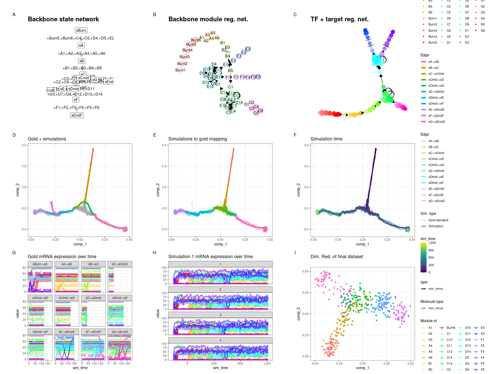<!-- -->

# Consecutive bifurcating

``` r
backbone <- backbone_consecutive_bifurcating()

init <- initialise_model(
  backbone = backbone,
  num_cells = 500,
  num_tfs = 100,
  num_targets = 50,
  num_hks = 25,
  simulation_params = simulation_default(census_interval = 10, ssa_algorithm = ssa_etl(tau = 300 / 3600))
)
out <- generate_dataset(init, make_plots = TRUE)
#> Generating TF network
#> Sampling feature network from real network
#> Generating kinetics for 175 features
#> Generating formulae
#> Generating gold standard mod changes
#> Precompiling reactions for gold standard
#> Running gold simulations
#>   |                                                  | 0 % elapsed=00s     |=====                                             | 8 % elapsed=00s, remaining~03s  |=========                                         | 17% elapsed=01s, remaining~04s  |=============                                     | 25% elapsed=01s, remaining~03s  |=================                                 | 33% elapsed=01s, remaining~02s  |=====================                             | 42% elapsed=01s, remaining~02s  |=========================                         | 50% elapsed=02s, remaining~02s  |==============================                    | 58% elapsed=02s, remaining~01s  |==================================                | 67% elapsed=02s, remaining~01s  |======================================            | 75% elapsed=02s, remaining~01s  |==========================================        | 83% elapsed=03s, remaining~01s  |==============================================    | 92% elapsed=03s, remaining~00s  |==================================================| 100% elapsed=03s, remaining~00s
#> Precompiling reactions for simulations
#> Running 32 simulations
#> Mapping simulations to gold standard
#> Warning in .generate_cells_predict_state(model): Simulation does not contain all gold standard edges. This simulation likely suffers from bad kinetics; choose a different seed and rerun.
#> Performing dimred
#> Simulating experiment
#> Wrapping dataset
#> Making plots
out$plot
```

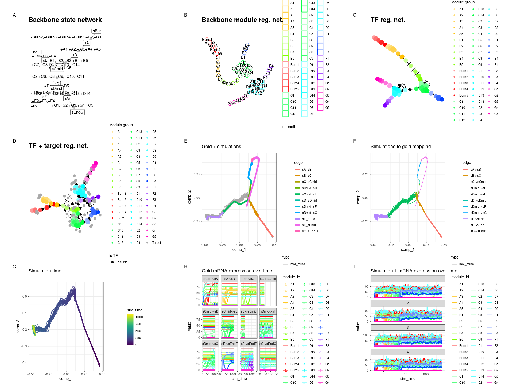<!-- -->

# Trifurcating

``` r
backbone <- backbone_trifurcating()

init <- initialise_model(
  backbone = backbone,
  num_cells = 500,
  num_tfs = 100,
  num_targets = 50,
  num_hks = 25
)
out <- generate_dataset(init, make_plots = TRUE)
#> Generating TF network
#> Sampling feature network from real network
#> Generating kinetics for 175 features
#> Generating formulae
#> Generating gold standard mod changes
#> Precompiling reactions for gold standard
#> Running gold simulations
#>   |                                                  | 0 % elapsed=00s     |=====                                             | 10% elapsed=00s, remaining~02s  |==========                                        | 20% elapsed=01s, remaining~02s  |===============                                   | 30% elapsed=01s, remaining~02s  |====================                              | 40% elapsed=01s, remaining~02s  |=========================                         | 50% elapsed=01s, remaining~01s  |==============================                    | 60% elapsed=02s, remaining~01s  |===================================               | 70% elapsed=02s, remaining~01s  |========================================          | 80% elapsed=02s, remaining~01s  |=============================================     | 90% elapsed=03s, remaining~00s  |==================================================| 100% elapsed=03s, remaining~00s
#> Precompiling reactions for simulations
#> Running 32 simulations
#> Mapping simulations to gold standard
#> Warning in .generate_cells_predict_state(model): Simulation does not contain all gold standard edges. This simulation likely suffers from bad kinetics; choose a different seed and rerun.
#> Performing dimred
#> Simulating experiment
#> Wrapping dataset
#> Making plots
out$plot
```

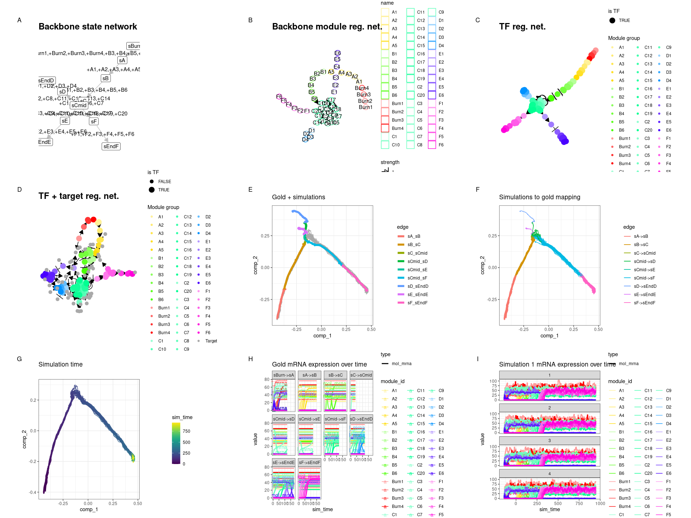<!-- -->

# Converging

``` r
backbone <- backbone_converging()

init <- initialise_model(
  backbone = backbone,
  num_cells = 500,
  num_tfs = 100,
  num_targets = 50,
  num_hks = 25,
  simulation_params = simulation_default(census_interval = 10, ssa_algorithm = ssa_etl(tau = 300 / 3600))
)
out <- generate_dataset(init, make_plots = TRUE)
#> Generating TF network
#> Sampling feature network from real network
#> Generating kinetics for 175 features
#> Generating formulae
#> Generating gold standard mod changes
#> Precompiling reactions for gold standard
#> Running gold simulations
#>   |                                                  | 0 % elapsed=00s     |=======                                           | 12% elapsed=00s, remaining~02s  |=============                                     | 25% elapsed=00s, remaining~01s  |===================                               | 38% elapsed=01s, remaining~01s  |=========================                         | 50% elapsed=01s, remaining~01s  |================================                  | 62% elapsed=01s, remaining~01s  |======================================            | 75% elapsed=01s, remaining~00s  |============================================      | 88% elapsed=01s, remaining~00s  |==================================================| 100% elapsed=02s, remaining~00s
#> Precompiling reactions for simulations
#> Running 32 simulations
#> Mapping simulations to gold standard
#> Performing dimred
#> Simulating experiment
#> Wrapping dataset
#> Making plots
out$plot
```

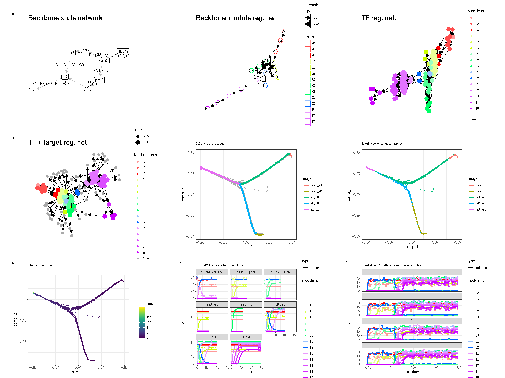<!-- -->

# Cycle

``` r
backbone <- backbone_cycle()

init <- initialise_model(
  backbone = backbone,
  num_cells = 500,
  num_tfs = 100,
  num_targets = 50,
  num_hks = 25,
  simulation_params = simulation_default(census_interval = 10, ssa_algorithm = ssa_etl(tau = 300 / 3600))
)
out <- generate_dataset(init, make_plots = TRUE)
#> Generating TF network
#> Sampling feature network from real network
#> Generating kinetics for 175 features
#> Generating formulae
#> Generating gold standard mod changes
#> Precompiling reactions for gold standard
#> Running gold simulations
#>   |                                                  | 0 % elapsed=00s     |=============                                     | 25% elapsed=01s, remaining~02s  |=========================                         | 50% elapsed=01s, remaining~01s  |======================================            | 75% elapsed=02s, remaining~01s  |==================================================| 100% elapsed=03s, remaining~00s
#> Precompiling reactions for simulations
#> Running 32 simulations
#> Mapping simulations to gold standard
#> Performing dimred
#> Simulating experiment
#> Wrapping dataset
#> Making plots
out$plot
```

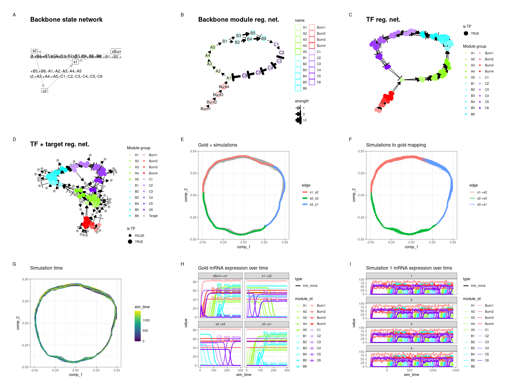<!-- -->

# Disconnected

``` r
backbone <- backbone_disconnected()

init <- initialise_model(
  backbone = backbone,
  num_cells = 500,
  num_tfs = 100,
  num_targets = 50,
  num_hks = 25,
  simulation_params = simulation_default(census_interval = 10, ssa_algorithm = ssa_etl(tau = 300 / 3600))
)
out <- generate_dataset(init, make_plots = TRUE)
#> Generating TF network
#> Sampling feature network from real network
#> Generating kinetics for 175 features
#> Generating formulae
#> Generating gold standard mod changes
#> Precompiling reactions for gold standard
#> Running gold simulations
#>   |                                                  | 0 % elapsed=00s     |===                                               | 6 % elapsed=00s, remaining~04s  |======                                            | 12% elapsed=00s, remaining~03s  |=========                                         | 18% elapsed=01s, remaining~03s  |============                                      | 24% elapsed=01s, remaining~02s  |===============                                   | 29% elapsed=01s, remaining~02s  |==================                                | 35% elapsed=01s, remaining~02s  |=====================                             | 41% elapsed=01s, remaining~02s  |========================                          | 47% elapsed=01s, remaining~02s  |===========================                       | 53% elapsed=02s, remaining~02s  |==============================                    | 59% elapsed=02s, remaining~01s  |=================================                 | 65% elapsed=02s, remaining~01s  |====================================              | 71% elapsed=02s, remaining~01s  |=======================================           | 76% elapsed=02s, remaining~01s  |==========================================        | 82% elapsed=02s, remaining~01s  |=============================================     | 88% elapsed=03s, remaining~00s  |================================================  | 94% elapsed=03s, remaining~00s  |==================================================| 100% elapsed=03s, remaining~00s
#> Precompiling reactions for simulations
#> Running 32 simulations
#> Mapping simulations to gold standard
#> Performing dimred
#> Simulating experiment
#> Wrapping dataset
#> Making plots
out$plot
```

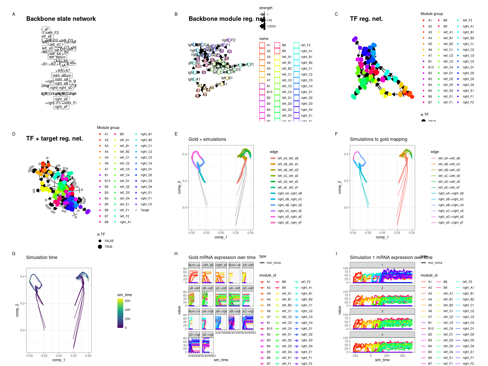<!-- -->

# Linear simple

``` r
backbone <- backbone_linear_simple()

init <- initialise_model(
  backbone = backbone,
  num_cells = 500,
  num_tfs = 100,
  num_targets = 50,
  num_hks = 25
)
out <- generate_dataset(init, make_plots = TRUE)
#> Generating TF network
#> Sampling feature network from real network
#> Generating kinetics for 175 features
#> Generating formulae
#> Generating gold standard mod changes
#> Precompiling reactions for gold standard
#> Running gold simulations
#>   |                                                  | 0 % elapsed=00s     |=========================                         | 50% elapsed=00s, remaining~00s  |==================================================| 100% elapsed=00s, remaining~00s
#> Precompiling reactions for simulations
#> Running 32 simulations
#> Mapping simulations to gold standard
#> Performing dimred
#> Simulating experiment
#> Wrapping dataset
#> Making plots
out$plot
```

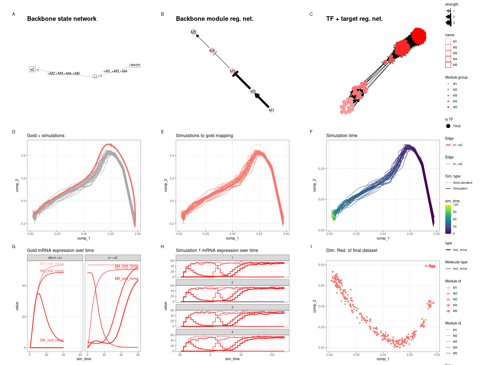<!-- -->

# Cycle simple

``` r
backbone <- backbone_cycle_simple()

init <- initialise_model(
  backbone = backbone,
  num_cells = 500,
  num_tfs = 100,
  num_targets = 50,
  num_hks = 25
)
out <- generate_dataset(init, make_plots = TRUE)
#> Generating TF network
#> Sampling feature network from real network
#> Generating kinetics for 175 features
#> Generating formulae
#> Generating gold standard mod changes
#> Precompiling reactions for gold standard
#> Running gold simulations
#>   |                                                  | 0 % elapsed=00s     |=============                                     | 25% elapsed=00s, remaining~01s  |=========================                         | 50% elapsed=00s, remaining~00s  |======================================            | 75% elapsed=01s, remaining~00s  |==================================================| 100% elapsed=01s, remaining~00s
#> Precompiling reactions for simulations
#> Running 32 simulations
#> Mapping simulations to gold standard
#> Performing dimred
#> Simulating experiment
#> Wrapping dataset
#> Making plots
out$plot
```

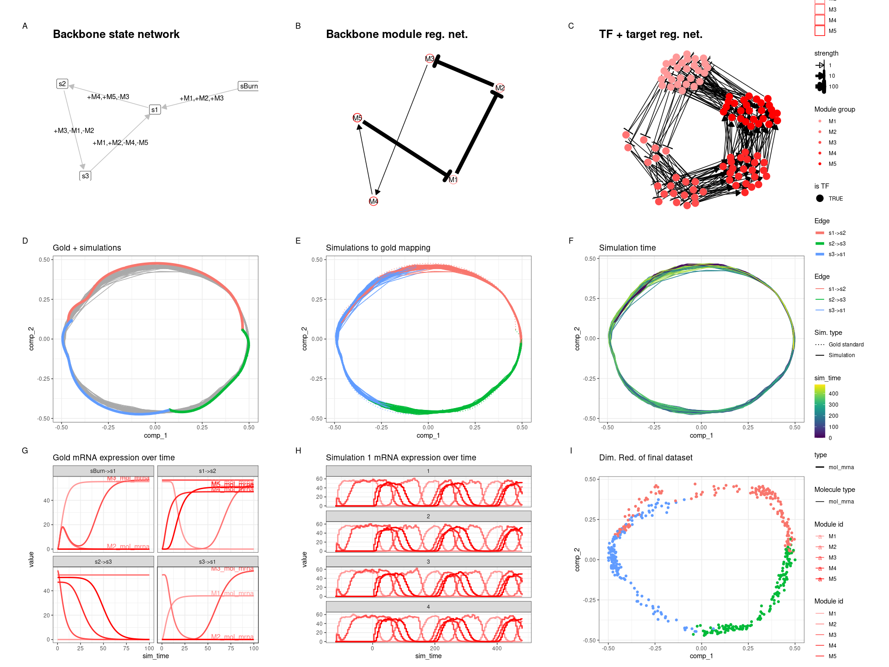<!-- -->
